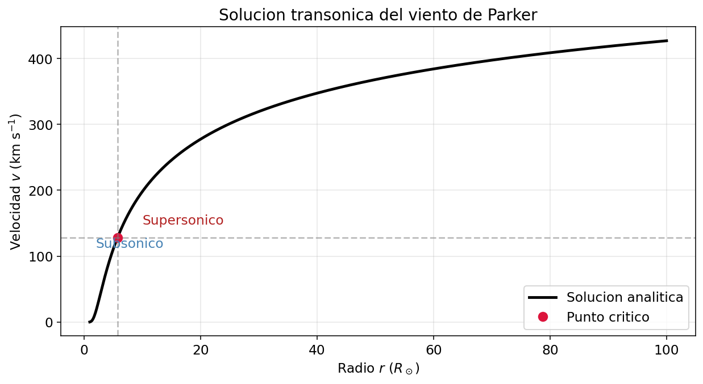
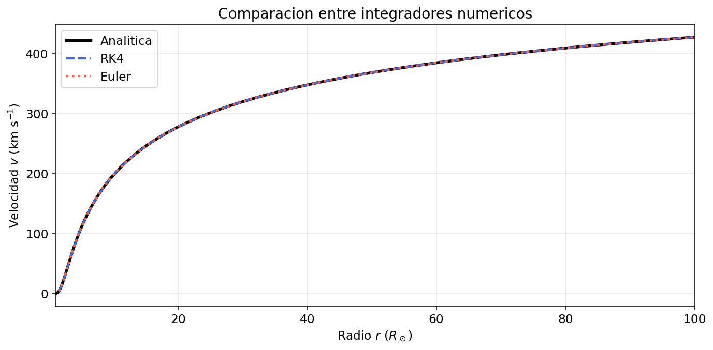
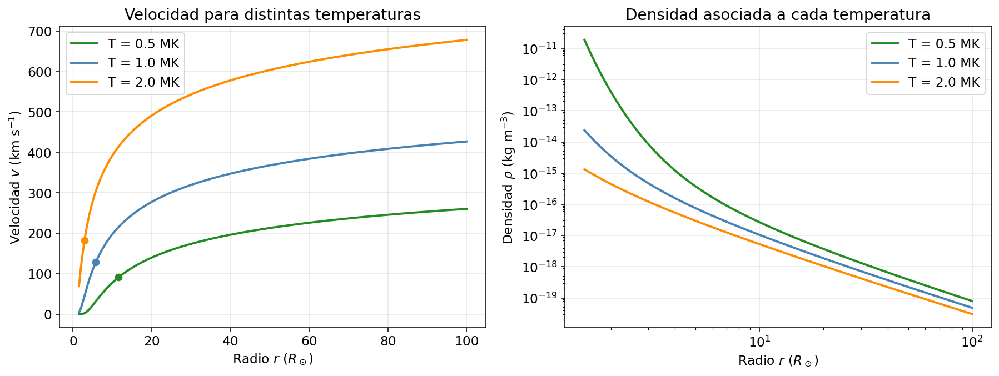
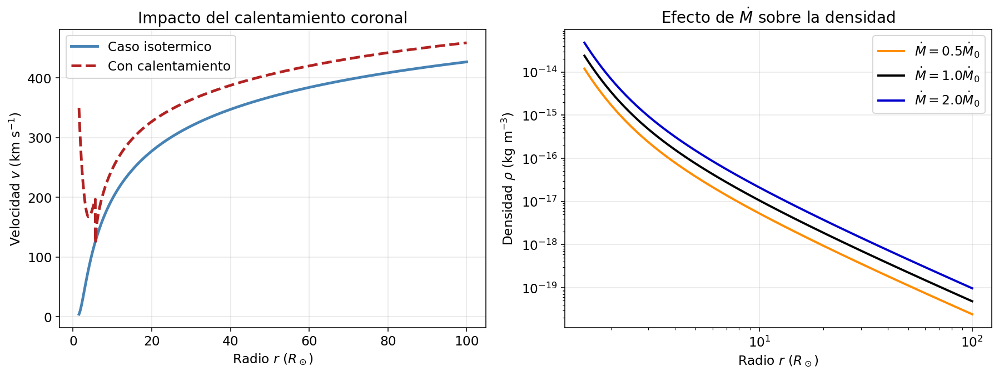

# 🌞 Viento Solar de Parker — Simulación Numérica

> *"¿Por qué la corona solar, una región de apenas unos pocos millones de grados,
> logra soplar plasma hasta Plutón a 400 km/s?
> Parker respondió eso en 1958. Aquí lo reproducimos."*

---

## ¿Qué es este proyecto?

Este proyecto modela numéricamente el **viento solar de Parker** — la corriente continua
de gas ionizado (plasma) que fluye hacia afuera de la corona del Sol y permea todo el Sistema Solar.

Resolvemos la EDO gobernante usando dos integradores codificados a mano — sin `solve_ivp`,
sin `odeint`, sin magia automática — y validamos los resultados contra una solución
semi-analítica por búsqueda de raíces.

---

## La Física en Dos Oraciones

La corona solar está tan caliente (~1 millón K) que existe un radio donde el gradiente
de presión hacia afuera equilibra exactamente la gravedad del Sol. Más allá de este
**radio crítico** $r_c$, el viento debe volverse supersónico — y lo hace.

La ecuación clave es la **ecuación de momento de Parker**, donde el
*término de advección* $v \, dv/dr$ es esencial:

$$
v \frac{dv}{dr} = \underbrace{\frac{2 v_c^2}{r}}_{\text{presión}} - \underbrace{\frac{G M_\odot}{r^2}}_{\text{gravedad}}
$$

La solución transónica (subsónica cerca del Sol, supersónica cerca de la Tierra) es
la *única* física cuando impones que el viento debe escapar al infinito.

---

## Estructura de Archivos

```
proyecto/
│
├── constantes.py                  ← Todas las constantes físicas en un lugar limpio
├── analitico.py                   ← Solución semi-analítica por búsqueda de raíces
├── solucionadores_numericos.py    ← Integradores manuales Euler y RK4 (¡sin scipy ODE!)
├── generar_notebook.py            ← Construye el cuaderno Jupyter programáticamente
│
├── figuras/                       ← Imágenes generadas desde el código
├── viento_solar_parker.ipynb      ← El reporte principal (generado por generar_notebook.py)
│
└── README.md                      ← Estás aquí
```

---

## Documentación de Módulos

### `constantes.py` — El Vecindario de los Números

Contiene todas las constantes SI para que cada otro archivo importe desde una fuente única.

| Nombre | Valor | Descripción |
|--------|-------|-------------|
| `GRAVEDAD` | 6.674×10⁻¹¹ m³ kg⁻¹ s⁻² | Constante G de Newton |
| `BOLTZMANN` | 1.381×10⁻²³ J K⁻¹ | Constante de Boltzmann |
| `MASA_PROTON` | 1.673×10⁻²⁷ kg | Masa de un protón |
| `MASA_SOL` | 1.989×10³⁰ kg | Masa total del Sol |
| `RADIO_SOL` | 6.96×10⁸ m | Radio del Sol |
| `PESO_MOLECULAR` | 0.5 | µ para H totalmente ionizado (iguales electrones y protones) |
| `TEMPERATURA_BASE` | 10⁶ K | Temperatura típica de la corona caliente |
| `FLUJO_MASA_BASE` | 1.26×10⁹ kg/s | ≈ 2×10⁻¹⁴ M☉/año de pérdida de masa solar |

**Función auxiliar:**

```python
convertir_flujo_masa_a_si(flujo_en_masas_solares_por_anio)
```
Convierte de "masas solares por año" (unidades astronómicas) a kg/s (unidades físicas).

---

### `analitico.py` — Confía en las Matemáticas

Implementa la solución exacta (semi-analítica) mediante búsqueda de raíces.

#### `donde_se_vuelve_sonico(temperatura)`
Calcula la **velocidad crítica** $v_c = \sqrt{k_B T / \mu m_p}$.
Esta es la velocidad del sonido isotérmica — el viento debe cruzar esta
velocidad exactamente una vez, en el radio crítico.

```
T = 1 MK  →  v_c ≈ 91 km/s
```

#### `radio_sonico(temperatura)`
Calcula el **radio crítico** $r_c = G M_\odot / 2 v_c^2$.
Debajo de este radio, el plasma es subsónico. Arriba, es supersónico.

```
T = 1 MK  →  r_c ≈ 5.8 R☉
```

#### `ley_de_conservacion_de_parker(v, r, v_c, r_c)`
El residuo de la ecuación integrada del viento de Parker — una función
que es igual a cero cuando `v` es la velocidad transónica correcta en el radio `r`.
Esto es lo que minimiza el buscador de raíces.

#### `cazar_velocidad_en_todo_el_espacio(arreglo_r, temperatura)`
El caballo de trabajo analítico principal. Para cada radio en `arreglo_r`, llama
al método de búsqueda de raíces de Brent sobre `ley_de_conservacion_de_parker`.
- Para $r < r_c$: busca la rama subsónica ($v < v_c$)
- Para $r > r_c$: busca la rama supersónica ($v > v_c$)

Regresa velocidades en **m/s**.

#### `cazar_velocidad_en_todo_el_espacio_newton_raphson(arreglo_r, temperatura)`
Resuelve la misma ecuación implícita, pero con **Newton-Raphson** explícito:

$$
v_{n+1} = v_n - \frac{f(v_n)}{f'(v_n)}
$$

Usa una semilla simple por rama y luego reutiliza la solución anterior como
estimado inicial en el siguiente radio. Es la versión más directa del método
pedido, y se compara en el cuaderno contra la solución con Brent.

---

### `solucionadores_numericos.py` — Haciendo la Integral a Mano

Implementa dos integradores manuales de EDO. La prohibición de `solve_ivp`
es intencional: construirlos a mano enseña qué significa realmente "integración numérica".

#### Idea numérica central

La EDO que integra el proyecto es:

$$
\frac{dv}{dr} =
\frac{2 v_c^2/r - G M_\odot/r^2 + Q(r)}
{v - v_c^2/v}
$$

El punto delicado aparece en $(r_c, v_c)$, donde numerador y denominador se anulan.
Para evitar esa singularidad numérica, la integración empieza a una distancia relativa
pequeña $\varepsilon = 10^{-3}$ a cada lado del punto crítico:

1. Una corrida hacia afuera construye la rama supersónica.
2. Otra corrida hacia adentro construye la rama subsónica.
3. Luego ambas se unen con el valor exacto del punto sónico.

#### `aceleracion_del_viento(r, v, velocidad_sonica, calentamiento=0.0)`
Calcula $dv/dr$ en un punto dado — el lado derecho de la EDO.
El `calentamiento` opcional agrega el término de extensión $Q(r)$ al numerador.

#### `pasos_de_bebe_euler(r, v, dr, velocidad_sonica, calor_en_r=0.0)`
Un paso del **método de Euler explícito**.

$$v_{n+1} = v_n + \frac{dv}{dr}\bigg|_{r_n} \cdot \Delta r$$

Primer orden de precisión. Requiere pasos pequeños (~10⁵ m) para mantenerse estable
cerca del punto sónico. Rápido y transparente, pero propenso a acumular errores.

Resumen práctico:
- Usa una sola pendiente local por paso.
- El error global crece como $\mathcal{O}(\Delta r)$.
- Es útil como referencia pedagógica y para comparar contra RK4.

#### `los_cuatro_elegantes_rk4(r, v, dr, velocidad_sonica, funcion_calor=None)`
Un paso del **método de Runge-Kutta de 4to orden**.

Evalúa la pendiente en cuatro sub-puntos estratégicos por paso y toma
un promedio ponderado: $(k_1 + 2k_2 + 2k_3 + k_4)/6$. Mucho más preciso
que Euler con el mismo (o mayor) tamaño de paso — puedes usar $\Delta r = 10^6$ m.

Resumen práctico:
- Corrige la trayectoria con información del inicio, mitad y final del paso.
- El error global cae como $\mathcal{O}(\Delta r^4)$.
- Es el método recomendado para producir las curvas finales del proyecto.

#### `lanzar_viento_solar(temperatura, r_min, r_max, tamano_paso, metodo, funcion_calor)`
El solucionador principal. Maneja el punto crítico singular integrando en dos
barridos separados (supersónico hacia afuera, subsónico hacia adentro) y luego uniéndolos.

```python
r, v, rho = lanzar_viento_solar(
    temperatura=1e6,     # K
    r_min=1.5,           # R☉ (frontera interna)
    r_max=100.0,         # R☉ (frontera externa)
    tamano_paso=1e6,     # metros por paso
    metodo='rk4',        # 'rk4' o 'euler'
    funcion_calor=None   # Q(r) opcional como función
)
# Regresa:
#   r   — radios en radios solares (R☉)
#   v   — velocidad en km/s
#   rho — densidad en kg/m³
```

---

## Cómo Correr el Proyecto

### Opción A: Lanzar el cuaderno Jupyter interactivo

```bash
# 1. Regenerar el .ipynb desde el código fuente
python generar_notebook.py

# 2. Abrirlo
jupyter notebook viento_solar_parker.ipynb
```

### Opción B: Usar cada módulo de forma independiente

```python
from constantes import TEMPERATURA_BASE, RADIO_SOL
from analitico import radio_sonico, donde_se_vuelve_sonico
from solucionadores_numericos import lanzar_viento_solar

v_c = donde_se_vuelve_sonico(TEMPERATURA_BASE)
r_c = radio_sonico(TEMPERATURA_BASE)
print(f"Punto sónico: v_c = {v_c/1e3:.1f} km/s en r_c = {r_c/RADIO_SOL:.2f} R☉")

r, v, rho = lanzar_viento_solar(TEMPERATURA_BASE)
```

---

## Contenido del Cuaderno

| Sección | Qué cubre |
|---------|-----------|
| **Parte 1** | Solución semi-analítica con Brent y Newton-Raphson; comparación de la curva transónica |
| **Parte 2** | Comparación Euler vs. RK4; tabla de errores relativos en $r = 50 R_\odot$ |
| **Parte 3** | Sensibilidad a la temperatura: $T = [0.5, 1, 2] \times 10^6$ K |
| **Parte 4** | Variación de tasa de pérdida de masa: prueba que $v(r)$ no depende de $\dot{M}$ |
| **Parte 5** | Extensión: término de calentamiento exponencial $Q(r) = Q_0 e^{-r/H}$ |

---

## Figuras Generadas

### Solución analítica transónica



### Comparación entre Euler y RK4



### Sensibilidad a la temperatura coronal



### Flujo de masa y calentamiento



---

## Resultados Clave de un Vistazo

Para los parámetros por defecto ($T = 10^6$ K, $\mu = 0.5$):

| Cantidad | Valor | Nota |
|----------|-------|------|
| Velocidad crítica $v_c$ | ~91 km/s | Velocidad del sonido isotérmica |
| Radio crítico $r_c$ | ~5.8 R☉ | Donde el flujo se vuelve supersónico |
| Velocidad en 1 UA (~215 R☉) | ~400 km/s | Coincide con el viento solar lento observado |
| Error relativo de RK4 en 50 R☉ | ~10⁻⁶ | Mucho mejor que Euler |

---

## ¿Por Qué Importa el Término de Advección?

Sin el término de advección $v \, dv/dr$, la ecuación de momento se convierte en
un equilibrio de presión estático — y el plasma nunca escaparía.
El término de advección permite que la energía cinética del flujo trabaje *contra* la gravedad,
habilitando que exista la solución transónica y que el viento llegue al infinito.

El artículo de Parker de 1958 fue inicialmente rechazado porque los revisores creyeron
que un flujo supersónico estacionario era físicamente imposible.
Él tenía razón. Ellos estaban equivocados. 🌬️

---
