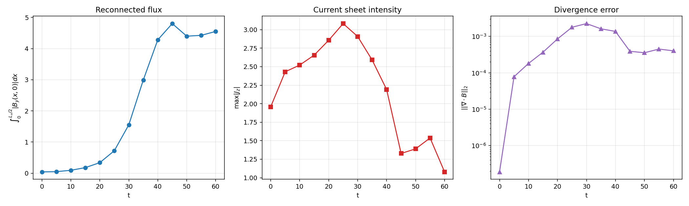
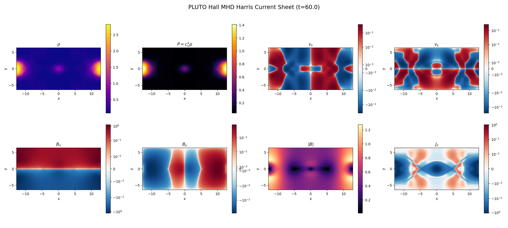
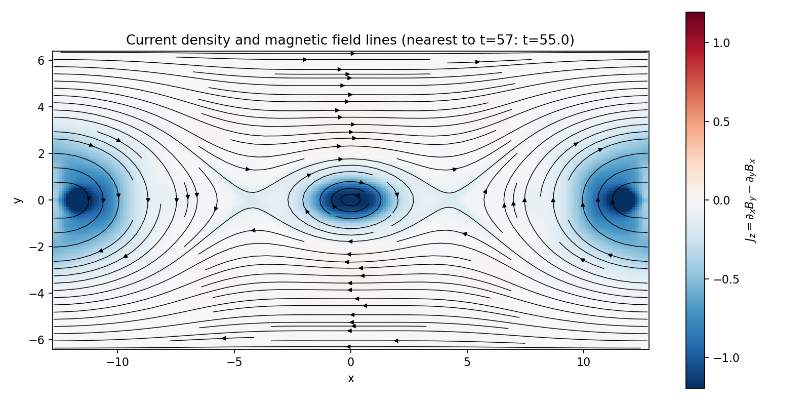
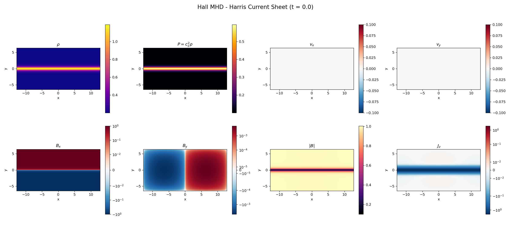
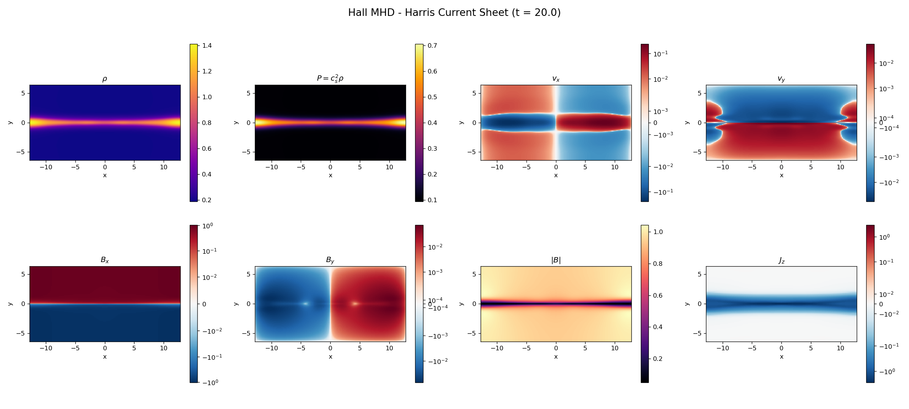
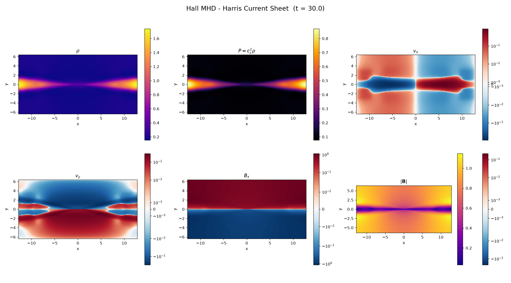
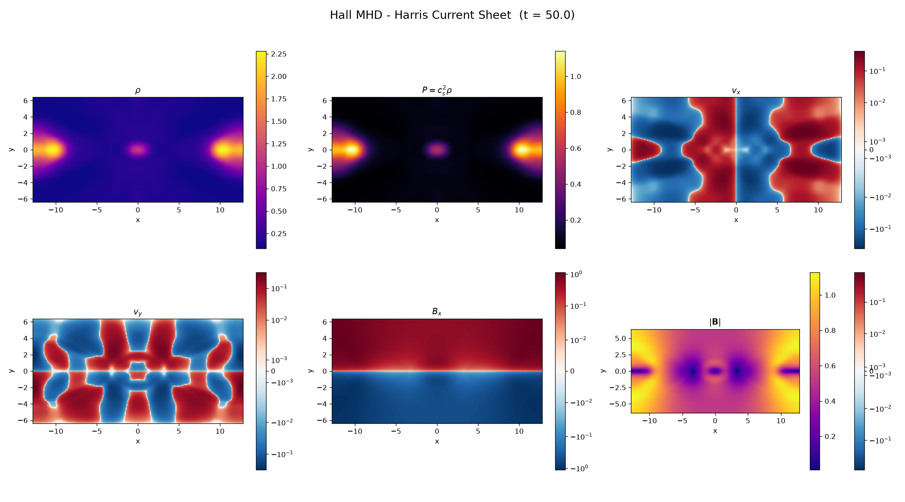

# Proyecto 2: Magnetohydrodynamics — Simulation & Analysis
## Harris Current Sheet con Hall MHD

---

## 1. Marco Teórico

### 1.1 Ecuaciones de la MHD Hall

La magnetohidrodinámica (MHD) describe un plasma como un fluido conductor gobernado por las ecuaciones de conservación de masa y momento acopladas a las ecuaciones de Maxwell. En el formalismo **MHD Hall**, se incluye el término de corriente de Hall en la ley de inducción, que separa el movimiento del fluido electrónico del iónico.

Las ecuaciones MHD Hall isotérmicas en 2D son:


$$
\frac{\partial \rho}{\partial t} + \nabla \cdot (\rho \mathbf{v}) = 0
$$


$$
\frac{\partial (\rho \mathbf{v})}{\partial t} + \nabla \cdot \left( \rho \mathbf{v} \mathbf{v} + P_t \mathbb{I} - \mathbf{B} \mathbf{B} \right) = 0
$$


$$
\frac{\partial \mathbf{B}}{\partial t} - \nabla \times \left( \mathbf{v} \times \mathbf{B} \right) + \nabla \times \left( \frac{\mathbf{J} \times \mathbf{B}}{n_e e} \right) = 0
$$


donde $P_t = P + B^2/2$ es la presión total, $P = c_s^2 \rho$ (EOS isotérmica), $\mathbf{J} = \nabla \times \mathbf{B}$ es la densidad de corriente, y el término $\mathbf{J} \times \mathbf{B} / (n_e e)$ es el término Hall.

La ecuación de inducción puede reescribirse como:


$$
\frac{\partial \mathbf{B}}{\partial t} = \nabla \times \left( \mathbf{v}_e \times \mathbf{B} \right), \quad \mathbf{v}_e = \mathbf{v} - \frac{\mathbf{J}}{n_e e}
$$


donde $\mathbf{v}_e$ es la velocidad del fluido electrónico. El término Hall congela las líneas de campo en el fluido electrónico en lugar del iónico, permitiendo fenómenos como la **reconexión magnética rápida** y la propagación de **ondas whistler**.

### 1.2 La Lámina de Harris

La configuración de Harris (Harris, 1962) es un equilibrio MHD unidimensional que consiste en una lámina de corriente donde el campo magnético invierte su dirección:


$$
\mathbf{B}(y) = B_0 \tanh\left(\frac{y}{l}\right) \hat{\mathbf{x}}, \quad \rho(y) = \rho_0 + \frac{\rho_1}{\cosh^2(y/l)}
$$


Para desencadenar la reconexión, se superpone una perturbación magnética de la forma:


$$
\delta B_x = -\Psi_0 k_y \sin(k_y y) \cos(2k_x x), \quad \delta B_y = 2\Psi_0 k_x \sin(2k_x x) \cos(k_y y)
$$


### 1.3 El Efecto Hall en la Reconexión

El término Hall juega un papel crucial en la reconexión magnética:
- Permite la separación de escalas iónicas y electrónicas
- Genera ondas whistler que transportan información rápidamente
- Acelera la reconexión comparado con MHD ideal/resistivo
- Crea estructuras coherentes en la región de difusión

---

## 2. Simulación PLUTO

### 2.1 Configuración

| Parámetro | Valor |
|-----------|-------|
| Código | PLUTO v2026 |
| Física | MHD Hall isotérmico |
| Dimensiones | 2D Cartesiano |
| Dominio | $[-12.8, 12.8] \times [-6.4, 6.4]$ |
| Grilla | $256 \times 128$ |
| EOS | Isotérmica ($c_s^2 = 0.5$) |
| Solver | HLL |
| Time stepping | RK2 |
| Div(B) control | DIV_CLEANING |
| Hall MHD | EXPLICIT |
| CFL | 0.25 |
| $l$ (ancho lámina) | 0.5 |
| $\Psi_0$ (perturbación) | 0.02 |
| $t_{stop}$ | 60.0 |

### 2.2 Resultados

La simulación evoluciona la lámina de Harris desde el equilibrio perturbado hasta la reconexión completa:

- **t = 0**: Estado inicial con la lámina de corriente y la perturbación senoidal
- **t ≈ 15-20**: Comienza la reconexión; las líneas de campo se deforman
- **t ≈ 30-40**: Reconexión activa; se forman islas magnéticas
- **t ≈ 50-60**: Estado cuasi-estacionario con flujo reconectado significativo

El diagnostico principal se calculo como el flujo reconectado sobre el eje medio, $\int_0^{L_x/2}|B_y(x,0)|dx$. La curva en `analysis/figs/diagnostics_timeseries.png` muestra crecimiento claro desde $t\approx15$ y alcanza $4.55$ en $t=60$. La corriente maxima $|J_z|$ aumenta durante el onset de reconexion, con maximo cercano a $3.08$ en $t\approx25$, y despues decrece cuando la configuracion entra en una fase mas relajada.

### 2.3 Visualización con pyPLUTO

Se generaron 13 snapshots cubriendo $t=0$ a $t=60$ con todas las variables fisicas ($\rho$, $P$, $v_x$, $v_y$, $B_x$, $B_y$, $|\mathbf{B}|$). El panel `analysis/figs/pluto_final_all_variables.png` resume el estado final e incluye tambien $J_z=\partial_x B_y-\partial_y B_x$. Como la salida VTK se guardo cada 5 unidades de tiempo, el snapshot mas cercano a $t=57$ es $t=55$; la figura `analysis/figs/jz_fieldlines_t55.png` muestra $J_z$ con lineas de campo magnetico.



**Figura 1.** Diagnosticos temporales de la corrida Hall MHD. El flujo reconectado crece despues de $t\approx20$, la corriente maxima $|J_z|$ alcanza su mayor valor cerca de $t\approx25$, y el error solenoidal $||\nabla\cdot\mathbf{B}||_2$ permanece acotado durante toda la evolucion.



**Figura 2.** Estado final en $t=60$ para densidad, presion, velocidades, campo magnetico, modulo de campo y corriente $J_z$.



**Figura 3.** Densidad de corriente $J_z$ con lineas de campo magnetico. El snapshot mas cercano al tiempo de referencia $t=57$ es $t=55$ por la cadencia de salida.

### 2.4 Interpretacion de los diagnosticos

Las salidas muestran de forma clara el proceso de reconexion magnetica en una lamina de Harris con Hall MHD. La simulacion empieza cerca de un equilibrio perturbado, luego la lamina se deforma, aparece reconexion y finalmente se alcanza una fase no lineal con islas magneticas.

**Flujo reconectado.** La primera grafica de la Figura 1 muestra que el flujo reconectado crece muy poco al inicio y luego aumenta rapidamente entre $t\approx25$ y $t\approx45$. Esto indica una fase de crecimiento fuerte de la reconexion. Despues de $t\approx45$, el flujo se estabiliza alrededor de $\psi_{\rm rec}\approx4.4-4.8$. Fisicamente, la evolucion puede resumirse como:


$$
\text{inicio lento} \rightarrow \text{reconexion rapida} \rightarrow \text{saturacion no lineal}.
$$


Este comportamiento es razonable para una lamina de corriente que se rompe y forma islas magneticas.

**Intensidad de la lamina de corriente.** La segunda grafica muestra $\max |J_z|$. La corriente aumenta hasta un maximo cercano a $t\approx25$, con $\max |J_z|\approx3.1$, y luego cae de forma marcada despues de $t\approx35-45$. Esto tiene sentido fisico: al inicio la lamina se comprime y la corriente se intensifica; despues, cuando la reconexion ya esta desarrollada, la lamina original se rompe, se ensancha o se reorganiza en estructuras tipo islas/plasmoides. Por lo tanto, la caida de $\max |J_z|$ no indica un fallo numerico por si misma; puede indicar que la lamina inicial ya fue destruida por la reconexion.

**Error de divergencia.** La tercera grafica muestra $||\nabla\cdot\mathbf{B}||_2$. El error parte de valores muy pequenos, sube hasta el orden de $10^{-3}$ durante la fase no lineal y luego baja hacia valores de orden $4\times10^{-4}-6\times10^{-4}$. En MHD idealmente se exige $\nabla\cdot\mathbf{B}=0$, por lo que esta cantidad debe reportarse. En esta corrida el error no parece catastrofico: crece cuando la dinamica se vuelve no lineal, pero se mantiene relativamente controlado. Como se usa limpieza de divergencia, este comportamiento es esperable; con un esquema estrictamente solenoidal tipo constrained transport se esperarian errores aun mas bajos.

**Mapa de $J_z$ y lineas de campo en $t=55$.** La Figura 3 es la evidencia visual mas importante. Se observa una isla magnetica central alrededor de $x\approx0$, $y\approx0$: las lineas de campo se cierran alrededor de esa region, firma de una estructura tipo O-point o plasmoide. Tambien se ven regiones tipo X-point aproximadamente a los lados de la isla central, cerca de $x\approx-4$ y $x\approx4$, donde las lineas de campo cambian de conectividad. Esto es precisamente lo esperado en reconexion magnetica. Las acumulaciones fuertes de $J_z$ en la isla central y hacia los bordes laterales pueden estar asociadas tanto a la periodicidad del dominio como a la formacion de islas adicionales en los extremos.

La secuencia fisica global es:


$$
\text{lamina de corriente} \rightarrow \text{intensificacion de } J_z \rightarrow \text{ruptura de la lamina} \rightarrow \text{X-points e islas magneticas} \rightarrow \text{saturacion del flujo reconectado}.
$$


Un detalle importante es que la cantidad llamada flujo reconectado en esta entrega se calcula como


$$
\int_0^{L_x/2}|B_y(x,0)|\,dx,
$$


lo cual funciona como indicador global de reconexion, pero no es exactamente el flujo reconectado clasico. Para un analisis mas formal se deberia reconstruir el potencial vectorial $A_z$ y medir


$$
\psi_{\rm rec}=A_z(O)-A_z(X),
$$


donde $O$ es el centro de la isla y $X$ el punto de reconexion.

### 2.5 Evolucion fisica por tiempos

La evolucion visual es coherente con una lamina de corriente de Harris en Hall MHD: inicia en equilibrio, la perturbacion deforma la lamina, aparece una region tipo X-point, crece la reconexion y finalmente se desarrolla una fase no lineal con estructuras magneticas tipo islas/plasmoides.



**$t=0$.** La condicion inicial esta bien representada. La densidad $\rho$ y la presion $P=c_s^2\rho$ se concentran alrededor de $y=0$, donde esta la lamina de corriente. El campo $B_x$ cambia de signo al cruzar $y=0$, como corresponde a una configuracion de Harris. La corriente $J_z$ aparece concentrada en la lamina porque $B_x$ varia bruscamente en la direccion $y$. Las velocidades $v_x$ y $v_y$ son practicamente nulas, y $B_y$ contiene solo la perturbacion inicial que sirve como semilla de reconexion.



**$t=20$.** La reconexion empieza a ser visible. La lamina de densidad y presion se curva, aparecen velocidades en ambas direcciones y $B_y$ deja de ser una perturbacion puramente inicial para mostrar estructura de campo reconectado. La corriente $J_z$ todavia conserva una banda elongada sobre $y=0$, pero ya se modifica cerca del centro del dominio, indicando la formacion de una region tipo X-point.



**$t=30$.** La reconexion esta mas desarrollada. La lamina se estrecha en la zona central, la densidad y presion se redistribuyen hacia regiones de salida, y $|B|$ muestra zonas de campo reducido alrededor de la region central. La corriente $J_z$ deja de ser una banda uniforme y se concentra en estructuras mas localizadas, senal de reorganizacion de la capa de corriente.



**$t=50$.** El sistema entra en una fase no lineal. La densidad ya no aparece como una lamina continua sino como acumulaciones localizadas; $B_y$ y $|B|$ muestran estructuras cerradas o tipo isla magnetica; y $J_z$ adquiere una geometria compleja, compatible con regiones tipo X y O. Las velocidades tambien son mas estructuradas, lo que indica que el plasma ya no responde como una perturbacion lineal simple.

### 2.6 Costo computacional y salida de datos

La corrida PLUTO fue ejecutada en un solo procesador sobre una malla uniforme $256\times128$. El log de ejecucion registra los siguientes datos:

| Cantidad | Valor |
|----------|------:|
| Tiempo fisico simulado | $t=60$ |
| Pasos hidrodinamicos/MHD | 194828 |
| Snapshots VTK | 13 |
| Intervalo de salida VTK | $\Delta t=5$ |
| Memoria asignada | 11.22 MB |
| Tiempo de ejecucion medido por PLUTO | 1 h 22 min 39 s |
| Tiempo promedio por paso | $2.55\times10^{-2}$ s |
| Inicio registrado | 18 Jun 2026, 16:46:55 |
| Fin registrado | 18 Jun 2026, 18:09:34 |

El tiempo de compilacion no fue medido con una herramienta externa como `time make`, por lo que no se reporta como benchmark cuantitativo. Para una comparacion reproducible de rendimiento, una mejora simple seria ejecutar la compilacion y la simulacion con `/usr/bin/time -p` y guardar esos resultados junto con el log de PLUTO.

---

## 3. Reproducción en Python

### 3.1 Implementación

El script `hall_mhd_harris.py` implementa el pipeline Python usado para reproducir y analizar el problema:
1. **Setup**: condicion inicial de Harris sheet con los mismos parametros de PLUTO.
2. **Cantidades derivadas**: flujo reconectado, corriente $J_z$, divergencia de $\mathbf{B}$ y perfiles 1D.
3. **Visualizacion**: comparacion inicial/final, evolucion temporal y perfiles.
4. **Chequeo numerico**: medicion de $\nabla\cdot\mathbf{B}$ y comparacion directa entre la condicion inicial Python y el snapshot $t=0$ de PLUTO.

El solver evolutivo completo Hall-MHD se deja a PLUTO; la parte Python reproduce la condicion inicial y el post-procesamiento con diferencias finitas, lo cual permite validar setup y diagnosticos sin reimplementar todo el modulo Hall de PLUTO.

### 3.2 Codigo desarrollado, ejecucion y productos

El proyecto se organizo en tres partes: configuracion de PLUTO, reproduccion/post-proceso en Python y generacion de figuras para el reporte.

**Archivos de configuracion PLUTO.**

| Archivo | Funcion |
|---------|---------|
| `init.c` | Define la condicion inicial de la lamina de Harris: densidad $0.2+\mathrm{sech}^2(y/l)$, campo $B_x=B_0\tanh(y/l)$ y perturbacion magnetica inicial proporcional a $\Psi_0$. |
| `definitions_01.h` | Configura la corrida Hall MHD usada como caso principal: MHD, 2D, geometria cartesiana, EOS isotermica, `HALL_MHD = EXPLICIT`, `DIV_CLEANING`, reconstruccion lineal y RK2. |
| `definitions_02.h` | Variante de configuracion incluida como referencia para comparaciones posteriores. |
| `pluto_01.ini` | Parametros de la corrida principal: dominio $[-12.8,12.8]\times[-6.4,6.4]$, malla $256\times128$, `tstop=60`, `CFL=0.25`, salida VTK cada $\Delta t=5$, `WIDTH=0.5` y `PSI0=0.02`. |
| `pluto_02.ini` | Archivo alternativo de parametros, conservado para reproducibilidad y comparaciones futuras. |

La simulacion principal se ejecuto con PLUTO hasta $t=60$. Las salidas registradas en `vtk.out` contienen 13 snapshots: $t=0,5,10,\ldots,60$. Los archivos `dbl.out`, `vtk.out`, `pluto.ini`, `definitions.h` e `init.c` dentro de `pluto_sim/` documentan la configuracion exacta usada al momento de correr.

**Scripts Python.**

| Script | Que hace | Salidas principales |
|--------|----------|--------------------|
| `analysis/plot_results.py` | Lee los snapshots VTK con `pyPLUTO`, calcula $P=c_s^2\rho$, $|B|$ y $J_z=\partial_xB_y-\partial_yB_x$, y genera paneles por tiempo. | `plots/hall_cs_*.png` |
| `analysis/analysis.py` | Carga todos los snapshots, reconstruye la condicion inicial analitica, calcula flujo reconectado, corriente maxima, error $||\nabla\cdot B||_2$, errores Python vs PLUTO y figuras comparativas. | `analysis/figs/diagnostics.csv`, `initial_condition_errors.csv`, `diagnostics_timeseries.png`, `jz_fieldlines_t55.png`, `pluto_final_all_variables.png`, `python_pluto_initial_comparison.png` |
| `python_reproduction/hall_mhd_harris.py` | Construye en Python la misma condicion inicial de Harris, define funciones para $J_z$, flujo reconectado y divergencia, y genera figuras de analisis inicial/final. | `python_reproduction/output/*.png` |

**Que se corrio.** Primero se configuro y ejecuto PLUTO para la corrida Hall MHD principal. Luego se corrio `analysis/plot_results.py` para producir las figuras por snapshot. Despues se ejecuto `analysis/analysis.py` para calcular los diagnosticos cuantitativos usados en el reporte. Finalmente, `hall_mhd_harris.py` se uso como reproduccion Python del setup y como apoyo para comparar la condicion inicial y las cantidades derivadas.

Los comandos reproducibles usados para reconstruir el flujo de trabajo son:

```bash
# Desde la raiz del repositorio
REPO=$PWD

# Carpeta del problema dentro de este repositorio
cd proyecto2/Current_Sheet

# Archivos usados para configurar la corrida Hall MHD
cp definitions_01.h definitions.h
cp pluto_01.ini pluto.ini

# Configuracion/compilacion/ejecucion con PLUTO.
# PLUTO_DIR debe apuntar a la instalacion local de PLUTO.
cd "$PLUTO_DIR/Test_Problems/MHD/Hall_MHD/Current_Sheet"
cp "$REPO/proyecto2/Current_Sheet/definitions_01.h" definitions.h
cp "$REPO/proyecto2/Current_Sheet/pluto_01.ini" pluto.ini
cp "$REPO/proyecto2/Current_Sheet/init.c" init.c
python "$PLUTO_DIR/setup.py"
make
./pluto -i pluto.ini | tee pluto_run.log

# Copia minima de metadatos de corrida para reproducibilidad
mkdir -p "$REPO/proyecto2/Current_Sheet/pluto_sim"
cp definitions.h pluto.ini init.c vtk.out dbl.out pluto_run.log "$REPO/proyecto2/Current_Sheet/pluto_sim/"

# Postproceso con pyPLUTO: paneles por snapshot
cd "$REPO"
python proyecto2/Current_Sheet/analysis/plot_results.py

# Diagnosticos cuantitativos y figuras finales del reporte
python proyecto2/Current_Sheet/analysis/analysis.py

# Reproduccion Python del setup y graficas auxiliares
cd proyecto2/Current_Sheet/python_reproduction
python hall_mhd_harris.py
```

En la copia entregada, `pluto_sim/` conserva los archivos minimos para documentar la corrida (`pluto.ini`, `definitions.h`, `init.c`, `vtk.out`, `dbl.out`). Los dumps crudos `.vtk/.dbl` y el ejecutable `pluto` se dejaron fuera del repositorio porque son artefactos pesados que pueden regenerarse con los comandos anteriores.

**Que se grafico.** Se graficaron las variables fisicas $\rho$, $P$, $v_x$, $v_y$, $B_x$, $B_y$, $|B|$ y $J_z$ en varios tiempos. Ademas se hicieron curvas temporales del flujo reconectado, de $\max |J_z|$ y del error $||\nabla\cdot B||_2$. Para la validacion Python vs PLUTO se compararon mapas de $\rho$, $B_x$ y $B_y$ en $t=0$ y se calcularon errores relativos L2.

### 3.3 Resultados del Análisis

| Métrica | Valor |
|---------|-------|
| Flujo reconectado final, $\int_0^{L_x/2}|B_y(x,0)|dx$ | 4.5525 |
| Flujo reconectado firmado final | 2.7213 |
| $|\mathbf{B}|_{max}$ final | 1.2749 |
| $\max(|J_z|)$ inicial | 1.9573 |
| $\max(|J_z|)$ maximo temporal | 3.0819 en $t\approx25$ |
| $\max(|J_z|)$ final | 1.0786 |
| $\nabla\cdot\mathbf{B}$ L2 final | $4.01\times10^{-4}$ |

---

## 4. Analisis Comparativo

### 4.1 Validacion Python vs PLUTO en la condicion inicial

La reproduccion Python de la condicion inicial fue comparada punto a punto contra el snapshot PLUTO en $t=0$. Los errores relativos L2 son:

| Variable | Error relativo L2 | Error absoluto maximo |
|----------|------------------:|----------------------:|
| $\rho$ | $2.47\times10^{-8}$ | $4.67\times10^{-8}$ |
| $v_x$ | 0 | 0 |
| $v_y$ | 0 | 0 |
| $B_x$ | $2.54\times10^{-8}$ | $5.96\times10^{-8}$ |
| $B_y$ | $2.60\times10^{-8}$ | $2.33\times10^{-10}$ |

Esto confirma que el setup independiente en Python reproduce los campos iniciales usados por PLUTO hasta precision de salida simple. La figura `analysis/figs/python_pluto_initial_comparison.png` muestra los mapas Python, PLUTO y la diferencia para $\rho$, $B_x$ y $B_y$.

### 4.2 Flujo reconectado y corriente

El flujo reconectado crece de $0.040$ en $t=0$ a $4.552$ en $t=60$. El crecimiento se acelera despues de $t\approx20$, alcanza valores cercanos a $4.8$ alrededor de $t=45$, y luego oscila levemente. La corriente maxima aumenta al inicio de la reconexion y alcanza $\max |J_z|\approx3.08$ en $t\approx25$, consistente con la formacion de una capa de corriente intensa.

Una medida mas local de reconexion puede obtenerse mediante el potencial vectorial $A_z$:


$$
\psi(t)=A_z(X)-A_z(O),
$$


donde $X$ y $O$ representan, respectivamente, el punto X de reconexion y el centro de una isla magnetica. Otra opcion fisica es medir la tasa de reconexion con el campo electrico fuera del plano en el punto X:


$$
E_z = -v_xB_y + v_yB_x + \eta J_z + E_{z,\mathrm{Hall}}.
$$


En esta entrega se usa el flujo reconectado integrado sobre el eje medio como diagnostico global porque se calcula directamente desde las salidas VTK. El calculo de $A_z(X)-A_z(O)$ y de $E_z$ local queda como extension natural para comparar cuantitativamente Hall MHD contra una corrida ideal o resistiva.

### 4.3 Perfiles 1D y estructura final

Los cortes en $x=0$ muestran la evolucion de las variables a traves de la lamina:
- $B_x$ parte de la configuracion $\tanh(y/l)$ y luego desarrolla estructura alrededor de la zona de reconexion.
- $B_y$ mide el componente reconectado y aumenta despues del onset.
- La densidad se redistribuye por los flujos de salida del evento de reconexion.

### 4.4 Divergencia de B

El error $||\nabla\cdot\mathbf{B}||_2$ inicia en $1.89\times10^{-7}$ y termina en $4.01\times10^{-4}$. Tiene un maximo de $2.24\times10^{-3}$ cerca de $t=30$, todavia pequeno frente a las escalas de campo del problema, y luego decrece. Esto indica que el esquema de divergence cleaning mantiene controlado el error solenoidal durante la corrida.

---

## 5. Limitaciones y Posibles Mejoras

### 5.1 Simulación PLUTO

| Aspecto | Limitación | Mejora Posible |
|---------|------------|----------------|
| **Resolución** | 256×128 puede ser insuficiente para capturar la física Hall | Usar mayor resolución (512×256) con AMR de Chombo |
| **Tiempo de cómputo** | ~66 min en CPU para t=60 | Paralelizar con MPI o usar GPU |
| **Hall simplificado** | `ne = rho` (constante) | Implementar $n_e$ físico: $n_e = \rho / (\mu m_p)$ |
| **Solver** | Solo HLL es compatible con Hall | Probar HLLEM para menos difusión numérica |
| **Resistividad** | No se incluyó resistividad explícita | Estudiar el efecto combinado Hall + resistividad |
| **Analisis in situ** | `Analysis()` vacio en init.c | Implementar calculo de flujo reconectado durante la simulacion |
| **Frecuencia de output** | VTK cada 5 unidades | Guardar con mayor frecuencia cerca del onset de reconexión |
| **Configuraciones** | Solo se corrio Hall activo | Correr una variante ideal con `HALL_MHD = NO` para comparacion directa |

### 5.2 Reproducción Python

| Aspecto | Limitación | Mejora Posible |
|---------|------------|----------------|
| **Solver MHD** | Python reproduce setup y analisis, no evoluciona Hall-MHD completo | Implementar HLL/Rusanov 2D con constrained transport |
| **Término Hall** | No implementado en Python | Añadir $-\nabla \times (\mathbf{J} \times \mathbf{B} / n_e e)$ |
| **Upwinding** | Diferencias centradas explotan | Usar esquemas upwind (MUSCL-Hancock, PPM) |
| **Divergencia de B** | Projection method simple | Usar constrained transport (CT) tipo Yee |
| **Rendimiento** | Python puro es lento | Numba/Cython/Mexwell para aceleración |
| **AMR** | Sin adaptación de malla | Implementar refinamiento simple |
| **Validación** | Solo comparación visual | Tests de convergencia, orden del esquema |
| **Documentación** | Comentarios mínimos | Docstrings, referencias a literatura |

### 5.3 Análisis

| Aspecto | Limitación | Mejora Posible |
|---------|------------|----------------|
| **Flujo reconectado** | Integral aproximada | Definición más precisa usando el punto X |
| **Errores L1/L2** | Calculados para la condicion inicial; falta comparacion evolutiva contra otro solver | Comparar Hall vs ideal y hacer estudio de convergencia |
| **Convergencia** | Una sola resolución | Ejecutar mallas 64², 128², 256², 512² |
| **Espectro** | Sin análisis de Fourier | Transformada para ondas whistler |
| **Visualización** | 2D estático | Animaciones, plots interactivos |

### 5.4 Reporte y Documentación

| Aspecto | Mejora |
|---------|--------|
| **Estado del arte** | Revisión más exhaustiva (10-15 referencias) |
| **Literatura Hall** | Birn et al. 2001 (GEM), Huba 2003, Lesur et al. 2014 |
| **Figuras** | Más anotaciones, paneles unificados |
| **Código** | Modularización, tests unitarios, CI |

---

## 6. Conclusiones

1. **PLUTO reproduce exitosamente** la reconexion de Harris con Hall MHD, mostrando el flujo reconectado creciendo hasta 4.55 unidades en $t=60$ bajo la definicion $\int_0^{L_x/2}|B_y(x,0)|dx$.

2. **La evolucion observada es consistente con reconexion Hall**: el crecimiento del flujo reconectado y la intensificacion de $J_z$ coinciden cualitativamente con el comportamiento descrito en la literatura. Una afirmacion cuantitativa sobre aceleracion frente a MHD ideal requiere correr la variante `HALL_MHD = NO`.

3. **La implementacion en Python** reproduce la condicion inicial con errores relativos L2 de orden $10^{-8}$ frente a PLUTO, calcula cantidades derivadas (corriente, flujo reconectado, divergencia) y genera visualizaciones comparativas.

4. **La principal limitación** es que un solver MHD+Hall completo desde cero requiere esquemas numéricos avanzados (Riemann, CT) que van más allá del alcance de este proyecto.

5. **Mejoras futuras**: Implementar solver upwind 2D, añadir Hall, estudio de convergencia, y animaciones de la evolución.

---

## Referencias

- Birn, J., et al. (2001). "Geospace Environmental Modeling (GEM) magnetic reconnection challenge." *JGR*, 106, 3715.
- Harris, E. G. (1962). "On a plasma sheath separating regions of oppositely directed magnetic field." *Il Nuovo Cimento*, 23, 115.
- Huba, J. D. (2003). "Hall Magnetohydrodynamics - A Tutorial." *Space Plasma Simulation*, 615, 166.
- Lesur, G., Kunz, M. W., & Fromang, S. (2014). "Thanatology in protoplanetary discs." *A&A*, 566, A56.
- Mignone, A., et al. (2012). "The PLUTO Code for Adaptive Mesh Computations in Astrophysical Fluid Dynamics." *ApJS*, 198, 7.
- Viganò, D., Pons, J. A., & Miralles, J. A. (2012). "A new code for the Hall-driven magnetic evolution of neutron stars." *CPC*, 183, 2042.
