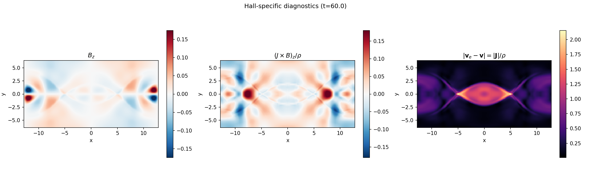

# Proyecto 2: Magnetohidrodinámica - Simulación y análisis
## Harris Current Sheet con Hall MHD

---

## Resumen y guía de lectura

Este reporte documenta una simulación de reconexión magnética en una lámina de corriente de Harris usando Hall MHD con PLUTO. La parte de PLUTO resuelve la evolución física completa de referencia; la parte de Python reproduce la condición inicial, implementa un solver Hall-MHD autocontenido de baja resolución, calcula diagnósticos y genera figuras auxiliares.

El proyecto queda organizado así:

| Ruta | Contenido |
|------|-----------|
| `Current_Sheet/` | Caso principal: configuración PLUTO, análisis, figuras y reporte. |
| `Current_Sheet/pluto_sim/` | Copia de la configuración usada en la corrida y, si están presentes localmente, salidas VTK/DBL regenerables. |
| `Current_Sheet/analysis/` | Scripts de postproceso para leer PLUTO, calcular diagnósticos y producir figuras finales. |
| `Current_Sheet/python_reproduction/` | Solver Python independiente, snapshots, diagnósticos y figuras auxiliares. |
| `Whistler_Waves/` | Configuraciones auxiliares para ondas whistler. |
| `PLUTO/` | Código PLUTO usado como dependencia externa/local. |

Los resultados centrales son: flujo reconectado final $4.5525$ bajo la métrica $\int_0^{L_x/2}|B_y(x,0)|dx$, máximo temporal $\max |J_z|=3.0819$ cerca de $t\approx25$, y error final $||\nabla\cdot\mathbf{B}||_2=4.01\times10^{-4}$. La comparación Python vs PLUTO en $t=0$ valida que la condición inicial fue reproducida con errores relativos L2 de orden $10^{-8}$.

### Correspondencia con el enunciado

| Requisito del proyecto | Dónde se responde | Estado |
|------------------------|-------------------|--------|
| Elegir un problema MHD al menos 2D desde `PLUTO/Test_Problems/MHD` | Se usa `MHD/Hall_MHD/Current_Sheet`, una lámina de Harris 2D. | Cumplido |
| Marco teórico, ecuaciones, condiciones de frontera y contexto físico | Secciones 1.1-1.5. | Cumplido |
| Reproducir una simulación PLUTO completa | Secciones 2.1-2.7 y archivos `Current_Sheet/init.c`, `definitions_01.h`, `pluto_01.ini`. | Cumplido |
| Graficar variables físicas con pyPLUTO | Secciones 2.4, 2.6 y script `analysis/plot_results.py`. | Cumplido |
| Implementación Python independiente | `python_reproduction/hall_mhd_harris.py` implementa un solver Hall-MHD 2.5D autocontenido con diferencias finitas, RK2, snapshots, CSV y figuras. | Cumplido |
| Comparación PLUTO vs Python y errores | Secciones 4.1-4.4 y `analysis/analysis.py`. | Cumplido para la condición inicial y diagnósticos |
| Discusión de limitaciones, fuentes de error y mejoras | Sección 5. | Cumplido |

La parte Python ahora tambien evoluciona el problema, pero no debe interpretarse como una copia numerica de PLUTO: usa diferencias finitas centradas, RK2, difusion explicita pequena y evolucion por potencial vectorial $A_z$ para mantener $\nabla\cdot\mathbf{B}$ controlado. PLUTO sigue siendo la referencia de alta resolucion y el solver Python funciona como implementacion independiente, reproducible y modificable para estudiar el mismo setup.

La ultima corrida Python regenerada fue una configuracion intermedia estable, con malla $128\times64$, $t_{\rm stop}=10$ y salidas cada $\Delta t=2$. Esta corrida produjo snapshots `.npz`, mapas 2D con $\nabla\cdot B$, `python_hall_mhd_diagnostics.csv`, `python_hall_mhd_timeseries.png`, `run_metadata.json` y `evolution.gif`. El resultado final fue: flujo reconectado unsigned $0.06308$, $\max |J_z|=1.59347$, $\max |B_z|=0.01290$ y $||\nabla\cdot B||_2=9.18\times10^{-17}$.

---

## 1. Marco Teórico

### 1.1 Ecuaciones de la MHD Hall

La magnetohidrodinámica (MHD) describe un plasma como un fluido conductor gobernado por las ecuaciones de conservación de masa y momento acopladas a las ecuaciones de Maxwell. En el formalismo **MHD Hall**, se incluye el término de corriente de Hall en la ley de inducción, que separa el movimiento del fluido electrónico del iónico.

Las ecuaciones MHD Hall isotérmicas en 2D son:

$$
\frac{\partial \rho}{\partial t} + \nabla \cdot (\rho \mathbf{v}) = 0
$$

$$
\frac{\partial (\rho \mathbf{v})}{\partial t} + \nabla \cdot \left( \rho \mathbf{v} \mathbf{v} + P_t \mathbb{I} - \mathbf{B} \mathbf{B} \right) = 0
$$

$$
\frac{\partial \mathbf{B}}{\partial t} - \nabla \times \left( \mathbf{v} \times \mathbf{B} \right) + \nabla \times \left( \frac{\mathbf{J} \times \mathbf{B}}{n_e e} \right) = 0
$$

donde $P_t = P + B^2/2$ es la presión total, $P = c_s^2 \rho$ (EOS isotérmica), $\mathbf{J} = \nabla \times \mathbf{B}$ es la densidad de corriente, y el término $\mathbf{J} \times \mathbf{B} / (n_e e)$ es el término Hall.

La ecuación de inducción puede reescribirse como:

$$
\frac{\partial \mathbf{B}}{\partial t} = \nabla \times \left( \mathbf{v}_e \times \mathbf{B} \right), \quad \mathbf{v}_e = \mathbf{v} - \frac{\mathbf{J}}{n_e e}
$$

donde $\mathbf{v}_e$ es la velocidad del fluido electrónico. El término Hall congela las líneas de campo en el fluido electrónico en lugar del iónico, permitiendo fenómenos como la **reconexión magnética rápida** y la propagación de **ondas whistler**.

### 1.2 La Lámina de Harris

La configuración de Harris (Harris, 1962) es un equilibrio MHD unidimensional que consiste en una lámina de corriente donde el campo magnético invierte su dirección:

$$
\mathbf{B}(y) = B_0 \tanh\left(\frac{y}{l}\right) \hat{\mathbf{x}}, \quad \rho(y) = \rho_0 + \frac{\rho_1}{\cosh^2(y/l)}
$$

Para desencadenar la reconexión, se superpone una perturbación magnética de la forma:

$$
\delta B_x = -\Psi_0 k_y \sin(k_y y) \cos(2k_x x), \quad \delta B_y = 2\Psi_0 k_x \sin(2k_x x) \cos(k_y y)
$$


### 1.3 El Efecto Hall en la Reconexión

El término Hall juega un papel crucial en la reconexión magnética:
- Permite la separación de escalas iónicas y electrónicas
- Genera ondas whistler que transportan información rápidamente
- Acelera la reconexión comparado con MHD ideal/resistivo
- Crea estructuras coherentes en la región de difusión

### 1.4 Condiciones de frontera y normalización

La corrida se hace en geometría cartesiana 2D con coordenadas $(x,y)$ y una tercera dirección inactiva. El dominio físico es

$$
x\in[-12.8,12.8], \qquad y\in[-6.4,6.4],
$$

discretizado con una malla uniforme $256\times128$. Las fronteras usadas en `pluto_01.ini` son periódicas en $x$ y reflectivas en $y$. La periodicidad en $x$ permite que la perturbación inicial sea compatible con el dominio horizontal; las fronteras reflectivas en $y$ mantienen confinada la lámina dentro del dominio vertical. La dirección $z$ se deja con una sola celda y condiciones de salida porque el problema es estrictamente 2D.

Las variables están en unidades normalizadas de PLUTO. Se usa una ecuación de estado isotérmica con $c_s^2=0.5$, densidad de fondo $\rho_{\rm bg}=0.2$, campo característico $B_0=1$, ancho de lámina $l=0.5$ y amplitud de perturbación $\Psi_0=0.02$.

### 1.5 Estado del arte resumido

La lámina de Harris es una configuración estándar para estudiar reconexión porque contiene una inversión de campo magnético sostenida por una capa de corriente. Harris (1962) introdujo este equilibrio como modelo idealizado de una hoja de plasma. En reconexión magnética moderna, el problema se usa para estudiar cómo cambia la topología del campo y cómo se convierte energía magnética en energía cinética y térmica.

El desafío GEM de Birn et al. (2001) convirtió la reconexión en una prueba comparativa entre distintos modelos numéricos: MHD resistiva, Hall MHD, híbridos y cinéticos. Una conclusión central de esa línea de trabajo es que el término Hall permite reconexión más rápida que la MHD resistiva simple, porque desacopla el movimiento electrónico del iónico cerca de la región de difusión. Huba (2003) resume la física Hall y muestra la conexión con ondas whistler, que transportan información magnética a escalas pequeñas. PLUTO incorpora estos ingredientes en un marco conservativo de dinámica de fluidos astrofísicos (Mignone et al. 2012), lo que permite reproducir pruebas 2D como la lámina de Harris con configuraciones controladas.

En aplicaciones astrofísicas, Hall MHD aparece en plasmas parcialmente ionizados, discos protoplanetarios, magnetosferas y evolución magnética de objetos compactos. Trabajos como Lesur et al. (2014) y Viganò et al. (2012) muestran que el término Hall puede modificar la estabilidad, el transporte angular y la evolución del campo magnético. Por eso, aunque este proyecto usa una prueba idealizada, el mecanismo físico estudiado es relevante para problemas más generales de reconexión y transporte magnético.

---

## 2. Simulación PLUTO

### 2.1 Configuración

| Parámetro | Valor |
|-----------|-------|
| Código | PLUTO v2026 |
| Física | MHD Hall isotérmico |
| Dimensiones | 2D Cartesiano |
| Dominio | $[-12.8, 12.8] \times [-6.4, 6.4]$ |
| Grilla | $256 \times 128$ |
| EOS | Isotérmica ($c_s^2 = 0.5$) |
| Solver | HLL |
| Time stepping | RK2 |
| Div(B) control | DIV_CLEANING |
| Hall MHD | EXPLICIT |
| CFL | 0.25 |
| $l$ (ancho lámina) | 0.5 |
| $\Psi_0$ (perturbación) | 0.02 |
| $t_{stop}$ | 60.0 |

### 2.2 Condiciones usadas en PLUTO

En PLUTO la simulacion queda definida por tres archivos principales: `definitions.h`, `init.c` y `pluto.ini`. En este proyecto se usaron los archivos del caso `Current_Sheet`, correspondientes a una lamina de corriente de Harris 2D en Hall MHD. A continuacion se resumen las condiciones mas importantes con el mismo formato del codigo.

#### `definitions.h`: fisica y metodo numerico

```c
#define  PHYSICS                        MHD
#define  DIMENSIONS                     2
#define  GEOMETRY                       CARTESIAN
#define  RECONSTRUCTION                 LINEAR
#define  TIME_STEPPING                  RK2
#define  EOS                            ISOTHERMAL
#define  DIVB_CONTROL                   DIV_CLEANING
#define  RESISTIVITY                    NO
#define  HALL_MHD                       EXPLICIT

#define  USER_DEF_PARAMETERS            3
#define  ETA                            0
#define  WIDTH                          1
#define  PSI0                           2

#define  LIMITER                        VANLEER_LIM
```

Estas opciones fijan el modelo fisico antes de compilar. `PHYSICS MHD` indica que se resuelven las ecuaciones magnetohidrodinamicas; `HALL_MHD EXPLICIT` agrega el termino Hall en la ecuacion de induccion, que es el ingrediente central para estudiar reconexion Hall. Se escogio `DIMENSIONS 2` porque la lamina de Harris necesita variacion en $x$ y $y$: el campo cambia con $y$ y la perturbacion que dispara la reconexion varia en $x$.

La ecuacion de estado `ISOTHERMAL` reduce el problema a presion proporcional a densidad, $P=c_s^2\rho$, evitando resolver una ecuacion de energia adicional. Esto permite concentrar el analisis en la dinamica magnetica y en el efecto Hall. `TIME_STEPPING RK2`, `RECONSTRUCTION LINEAR` y `VANLEER_LIM` dan un esquema de segundo orden suficientemente estable para capturar gradientes en la lamina sin introducir oscilaciones numericas fuertes. `DIV_CLEANING` se selecciono para controlar errores de $\nabla\cdot\mathbf{B}$ durante la evolucion.

Los parametros `ETA`, `WIDTH` y `PSI0` se leen desde `pluto.ini`. En la corrida principal `ETA` queda definido pero no se usa porque `RESISTIVITY` esta en `NO`; se conserva como parte de la plantilla del problema y para facilitar comparaciones con corridas resistivas.

#### `init.c`: condicion inicial

```c
double cs2 = 0.5, b0 = 1.0, l, Psi0;

l = g_inputParam[WIDTH];
v[RHO] = 0.2 + 1.0/(cosh(y/l)*(cosh(y/l)));

#if HAVE_ENERGY
  v[PRS] = cs2*v[RHO];
#else
  g_isoSoundSpeed = sqrt(cs2);
#endif

v[VX1] = 0.0;
v[VX2] = 0.0;
v[VX3] = 0.0;

v[BX1] = b0*tanh(y/l);
v[BX2] = 0.0;
v[BX3] = 0.0;

Lx = g_domEnd[IDIR] - g_domBeg[IDIR]; kx = CONST_PI/Lx;
Ly = g_domEnd[JDIR] - g_domBeg[JDIR]; ky = CONST_PI/Ly;

Psi0    = g_inputParam[PSI0];
v[BX1] += -Psi0*ky*sin(ky*y)*cos(2.0*kx*x);
v[BX2] +=  Psi0*2.0*kx*sin(2.0*kx*x)*cos(ky*y);
```

Este archivo define el estado inicial de la simulacion. La densidad

$$
\rho(y)=0.2+\frac{1}{\cosh^2(y/l)}
$$

concentra plasma alrededor de $y=0$, justo donde esta la lamina de corriente. El campo

$$
B_x(y)=B_0\tanh(y/l)
$$

cambia de signo al cruzar el centro del dominio, produciendo la inversion magnetica caracteristica de una lamina de Harris. La velocidad inicial se toma cero para partir de un equilibrio perturbado y no de un flujo impuesto artificialmente.

El parametro `WIDTH` controla el ancho $l$ de la lamina. Se eligio `WIDTH = 0.5` porque produce una capa suficientemente delgada para formar una corriente intensa, pero todavia resoluble con la malla $256\times128$. El parametro `PSI0` controla la perturbacion magnetica inicial. Se eligio `PSI0 = 0.02` porque es pequena frente al campo principal $B_0=1$: actua como semilla de reconexion sin destruir desde el inicio la configuracion de Harris. Inicialmente `BX3 = 0`; por eso cualquier $B_z$ que aparece despues es una firma de la evolucion Hall y no una condicion impuesta.

#### `pluto.ini`: dominio, tiempo, fronteras y salida

```ini
[Grid]
X1-grid    1    -12.8   256   u   12.8
X2-grid    1     -6.4   128   u    6.4
X3-grid    1      0.0     1   u    1.0

[Time]
CFL               0.25
CFL_max_var       1.1
tstop             60.0
first_dt          1.e-4

[Solver]
Solver            hll

[Boundary]
X1-beg            periodic
X1-end            periodic
X2-beg            reflective
X2-end            reflective
X3-beg            outflow
X3-end            outflow

[Static Grid Output]
vtk               5.0  -1   single_file
log               10

[Parameters]
ETA               2.e-3
WIDTH             0.5
PSI0              0.02
```

El dominio $[-12.8,12.8]\times[-6.4,6.4]$ se eligio para que la lamina quede centrada y haya espacio suficiente para que la perturbacion evolucione sin interactuar inmediatamente con las fronteras verticales. La malla $256\times128$ mantiene la misma resolucion espacial en ambas direcciones, $\Delta x=\Delta y=0.1$, lo cual evita anisotropias numericas innecesarias en el analisis de la reconexion.

Las fronteras periodicas en $x$ son compatibles con la perturbacion senoidal usada en `init.c`. Las fronteras reflectivas en $y$ mantienen confinada la lamina dentro del dominio vertical. En $z$ se usa una sola celda con fronteras de salida porque el problema es 2D, aunque se conservan las tres componentes de velocidad y campo magnetico.

El `CFL = 0.25` es conservador para una corrida Hall MHD explicita, donde las ondas whistler pueden imponer pasos de tiempo pequenos. `first_dt = 1.e-4` evita un primer paso demasiado grande antes de que PLUTO ajuste automaticamente el paso temporal. `tstop = 60.0` permite cubrir la fase inicial, el inicio de reconexion, el crecimiento no lineal y la saturacion aproximada observada en los diagnosticos. El solver `hll` se selecciono por robustez en discontinuidades y capas de corriente. La salida `vtk = 5.0` fue la usada en el log de ejecucion para generar snapshots en $t=0,5,\ldots,60$; esos archivos son los que se postprocesaron con pyPLUTO.

### 2.3 Resultados

La simulación evoluciona la lámina de Harris desde el equilibrio perturbado hasta la reconexión completa:

- **t = 0**: Estado inicial con la lámina de corriente y la perturbación senoidal
- **t ≈ 15-20**: Comienza la reconexión; las líneas de campo se deforman
- **t ≈ 30-40**: Reconexión activa; se forman islas magnéticas
- **t ≈ 50-60**: Estado cuasi-estacionario con flujo reconectado significativo

El diagnostico principal se calculo como el flujo reconectado sobre el eje medio, $\int_0^{L_x/2}|B_y(x,0)|dx$. La curva en `analysis/figs/diagnostics_timeseries.png` muestra crecimiento claro desde $t\approx15$ y alcanza $4.55$ en $t=60$. La corriente maxima $|J_z|$ aumenta durante el onset de reconexion, con maximo cercano a $3.08$ en $t\approx25$, y despues decrece cuando la configuracion entra en una fase mas relajada.

### 2.4 Visualización con pyPLUTO

Se generaron 13 snapshots cubriendo $t=0$ a $t=60$ con todas las variables fisicas ($\rho$, $P$, $v_x$, $v_y$, $B_x$, $B_y$, $B_z$, $|\mathbf{B}|$). El panel `analysis/figs/pluto_final_all_variables.png` resume el estado final e incluye tambien $J_z=\partial_x B_y-\partial_y B_x$. Como la salida VTK se guardo cada 5 unidades de tiempo, el snapshot mas cercano a $t=57$ es $t=55$; la figura `analysis/figs/jz_fieldlines_t55.png` muestra $J_z$ con lineas de campo magnetico y anotaciones de los puntos O/X.


**Figura 1.** Diagnosticos temporales de la corrida Hall MHD. El flujo reconectado crece despues de $t\approx20$, la corriente maxima $|J_z|$ alcanza su mayor valor cerca de $t\approx25$, y el error solenoidal $||\nabla\cdot\mathbf{B}||_2$ permanece acotado durante toda la evolucion.


**Figura 2.** Estado final en $t=60$ para densidad, presion, velocidades, campo magnetico, modulo de campo y corriente $J_z$.


**Figura 3.** Densidad de corriente $J_z$ con lineas de campo magnetico. El marcador O indica el centro aproximado de la isla magnetica y los marcadores X indican regiones laterales donde cambia la conectividad del campo. El snapshot mas cercano al tiempo de referencia $t=57$ es $t=55$ por la cadencia de salida.



**Figura 4.** Diagnosticos especificos del efecto Hall en $t=60$: campo fuera del plano $B_z$, componente fuera del plano del termino Hall $(\mathbf{J}\times\mathbf{B})_z/\rho$ y magnitud del desacoplamiento ion-electron $|\mathbf{v}_e-\mathbf{v}|=|\mathbf{J}|/\rho$, usando $n_e e\simeq\rho$ en las unidades normalizadas de esta corrida.

### 2.5 Interpretacion de los diagnosticos

Las salidas muestran de forma clara el proceso de reconexion magnetica en una lamina de Harris con Hall MHD. La simulacion empieza cerca de un equilibrio perturbado, luego la lamina se deforma, aparece reconexion y finalmente se alcanza una fase no lineal con islas magneticas.

**Flujo reconectado.** La primera grafica de la Figura 1 muestra que el flujo reconectado crece muy poco al inicio y luego aumenta rapidamente entre $t\approx25$ y $t\approx45$. Esto indica una fase de crecimiento fuerte de la reconexion. Despues de $t\approx45$, el flujo se estabiliza alrededor de $\psi_{\rm rec}\approx4.4-4.8$. Fisicamente, la evolucion puede resumirse como:

$$
\text{inicio lento} \rightarrow \text{reconexion rapida} \rightarrow \text{saturacion no lineal}.
$$

Este comportamiento es razonable para una lamina de corriente que se rompe y forma islas magneticas.

**Intensidad de la lamina de corriente.** La segunda grafica muestra $\max |J_z|$. La corriente aumenta hasta un maximo cercano a $t\approx25$, con $\max |J_z|\approx3.1$, y luego cae de forma marcada despues de $t\approx35-45$. Esto tiene sentido fisico: al inicio la lamina se comprime y la corriente se intensifica; despues, cuando la reconexion ya esta desarrollada, la lamina original se rompe, se ensancha o se reorganiza en estructuras tipo islas/plasmoides. Por lo tanto, la caida de $\max |J_z|$ no indica un fallo numerico por si misma; puede indicar que la lamina inicial ya fue destruida por la reconexion.

**Error de divergencia.** La tercera grafica muestra $||\nabla\cdot\mathbf{B}||_2$. El error parte de valores muy pequenos, sube hasta el orden de $10^{-3}$ durante la fase no lineal y luego baja hacia valores de orden $4\times10^{-4}-6\times10^{-4}$. En MHD idealmente se exige $\nabla\cdot\mathbf{B}=0$, por lo que esta cantidad debe reportarse. En esta corrida el error no parece catastrofico: crece cuando la dinamica se vuelve no lineal, pero se mantiene relativamente controlado. Como se usa limpieza de divergencia, este comportamiento es esperable; con un esquema estrictamente solenoidal tipo constrained transport se esperarian errores aun mas bajos.

**Mapa de $J_z$ y lineas de campo en $t=55$.** La Figura 3 es la evidencia visual mas importante. Se observa una isla magnetica central alrededor de $x\approx0$, $y\approx0$: las lineas de campo se cierran alrededor de esa region, firma de una estructura tipo O-point o plasmoide. Tambien se ven regiones tipo X-point aproximadamente a los lados de la isla central, cerca de $x\approx-5$ y $x\approx5$, donde las lineas de campo cambian de conectividad. Esto es precisamente lo esperado en reconexion magnetica. Las acumulaciones fuertes de $J_z$ en la isla central y hacia los bordes laterales pueden estar asociadas tanto a la periodicidad del dominio como a la formacion de islas adicionales en los extremos.

**Firma Hall.** La Figura 4 muestra una huella mas directa del efecto Hall. Aunque la condicion inicial tiene $B_z=0$ y $v_z=0$, la evolucion genera campo y velocidad fuera del plano: en $t=60$ se obtiene $\max |B_z|=0.223$ y $\max |v_z|=0.445$. La componente $(\mathbf{J}\times\mathbf{B})_z/\rho$ alcanza valores de orden $0.208$, lo que indica que el termino Hall no solo esta activado numericamente, sino que contribuye de forma localizada cerca de la region de reconexion.

La secuencia fisica global es:

$$
\text{lamina de corriente} \rightarrow \text{intensificacion de } J_z \rightarrow \text{ruptura de la lamina} \rightarrow \text{X-points e islas magneticas} \rightarrow \text{saturacion del flujo reconectado}.
$$

Un detalle importante es que la cantidad llamada flujo reconectado en esta entrega se calcula como

$$
\int_0^{L_x/2}|B_y(x,0)|\,dx,
$$

lo cual funciona como indicador global de reconexion, pero no es exactamente el flujo reconectado clasico. Para obtener una medida mas local se reconstruyo tambien el potencial vectorial $A_z$ a partir de

$$
B_x=\frac{\partial A_z}{\partial y}, \qquad B_y=-\frac{\partial A_z}{\partial x},
$$

y se estimo

$$
\psi_{A_z}=|A_z(O)-A_z(X)|.
$$

En $t=60$, usando el O-point central y el X-point lateral mas contrastado, se obtiene $\psi_{A_z}\approx0.915$. Esta cantidad no reemplaza por completo un algoritmo automatico robusto de deteccion de puntos criticos, pero es una medida fisicamente mas cercana al flujo reconectado clasico que la integral global de $|B_y|$.

### 2.6 Evolucion fisica por tiempos

La evolucion visual es coherente con una lamina de corriente de Harris en Hall MHD: inicia en equilibrio, la perturbacion deforma la lamina, aparece una region tipo X-point, crece la reconexion y finalmente se desarrolla una fase no lineal con estructuras magneticas tipo islas/plasmoides.

| Tiempo | Estado fisico | Evidencia principal |
|--------|---------------|--------------------|
| $t=0$ | Equilibrio perturbado | Lamina de Harris, $v\approx0$, inversion de $B_x$ y perturbacion inicial en $B_y$. |
| $t=20$ | Inicio de reconexion | Deformacion de la lamina, aparicion de flujos y crecimiento de la componente reconectada. |
| $t=30$ | Reconexion activa | Intensificacion de $J_z$, reorganizacion de la capa de corriente y region tipo X. |
| $t=50$ | Regimen no lineal | Isla magnetica, redistribucion de densidad y estructura compleja en $J_z$. |
| $t=60$ | Saturacion aproximada | Flujo reconectado casi estabilizado y presencia clara de componentes Hall fuera del plano. |


**$t=0$.** La condicion inicial esta bien representada. La densidad $\rho$ y la presion $P=c_s^2\rho$ se concentran alrededor de $y=0$, donde esta la lamina de corriente. El campo $B_x$ cambia de signo al cruzar $y=0$, como corresponde a una configuracion de Harris. La corriente $J_z$ aparece concentrada en la lamina porque $B_x$ varia bruscamente en la direccion $y$. Las velocidades $v_x$ y $v_y$ son practicamente nulas, y $B_y$ contiene solo la perturbacion inicial que sirve como semilla de reconexion.


**$t=20$.** La reconexion empieza a ser visible. La lamina de densidad y presion se curva, aparecen velocidades en ambas direcciones y $B_y$ deja de ser una perturbacion puramente inicial para mostrar estructura de campo reconectado. La corriente $J_z$ todavia conserva una banda elongada sobre $y=0$, pero ya se modifica cerca del centro del dominio, indicando la formacion de una region tipo X-point.


**$t=30$.** La reconexion esta mas desarrollada. La lamina se estrecha en la zona central, la densidad y presion se redistribuyen hacia regiones de salida, y $|B|$ muestra zonas de campo reducido alrededor de la region central. La corriente $J_z$ deja de ser una banda uniforme y se concentra en estructuras mas localizadas, senal de reorganizacion de la capa de corriente.


**$t=50$.** El sistema entra en una fase no lineal. La densidad ya no aparece como una lamina continua sino como acumulaciones localizadas; $B_y$ y $|B|$ muestran estructuras cerradas o tipo isla magnetica; y $J_z$ adquiere una geometria compleja, compatible con regiones tipo X y O. Las velocidades tambien son mas estructuradas, lo que indica que el plasma ya no responde como una perturbacion lineal simple.

### 2.7 Costo computacional y salida de datos

La corrida PLUTO fue ejecutada en un solo procesador sobre una malla uniforme $256\times128$. El log de ejecucion registra los siguientes datos:

| Cantidad | Valor |
|----------|------:|
| Tiempo fisico simulado | $t=60$ |
| Pasos hidrodinamicos/MHD | 194828 |
| Snapshots VTK | 13 |
| Intervalo de salida VTK | $\Delta t=5$ |
| Memoria asignada | 11.22 MB |
| Tiempo de ejecucion medido por PLUTO | 1 h 22 min 39 s |
| Tiempo promedio por paso | $2.55\times10^{-2}$ s |
| Inicio registrado | 18 Jun 2026, 16:46:55 |
| Fin registrado | 18 Jun 2026, 18:09:34 |

El tiempo de compilacion no fue medido con una herramienta externa como `time make`, por lo que no se reporta como benchmark cuantitativo. Para una comparacion reproducible de rendimiento, una mejora simple seria ejecutar la compilacion y la simulacion con `/usr/bin/time -p` y guardar esos resultados junto con el log de PLUTO.

---

## 3. Reproducción en Python

### 3.1 Implementación

El script `hall_mhd_harris.py` implementa una simulacion Python independiente del problema. No usa `pyPLUTO` ni lee snapshots de PLUTO: construye la malla, inicializa la lamina de Harris, evoluciona una version Hall-MHD 2.5D con diferencias finitas, guarda snapshots y calcula diagnosticos propios. Es una implementacion educativa y autocontenida; PLUTO sigue siendo la referencia numerica conservativa de alta resolucion.

#### 3.1.1 Variables evolucionadas

El estado numerico se guarda en la clase `State`:

| Variable | Significado |
|----------|-------------|
| `rho` | Densidad $\rho$. |
| `vx`, `vy`, `vz` | Componentes de velocidad $\mathbf{v}$. |
| `az` | Potencial vectorial fuera del plano $A_z$. |
| `bz` | Campo magnetico fuera del plano $B_z$. |

El campo magnetico dentro del plano no se evoluciona directamente. Se reconstruye desde $A_z$:

$$
B_x=\frac{\partial A_z}{\partial y}, \qquad B_y=-\frac{\partial A_z}{\partial x}.
$$

Con esta eleccion, la divergencia del campo dentro del plano queda controlada por construccion:

$$
\nabla\cdot\mathbf{B}_{xy}
=\frac{\partial B_x}{\partial x}+\frac{\partial B_y}{\partial y}
=\frac{\partial^2 A_z}{\partial x\partial y}
-\frac{\partial^2 A_z}{\partial y\partial x}\approx0.
$$

Esto no es el mismo constrained transport de PLUTO, pero evita que el solver Python genere errores grandes de $\nabla\cdot\mathbf{B}$ en el campo in-plane.

#### 3.1.2 Condicion inicial

La condicion inicial reproduce la lamina de Harris. En el script, los parametros principales son modificables desde la linea de comandos: `--cs2`, `--b0`, `--width`, `--psi0`, `--hall-coeff`, `--eta`, `--nu`, `--eta-h`, `--nu-h`, `--cfl` y `--cfl-hall`.

$$
\rho(x,y)=0.2+\operatorname{sech}^2(y/l),
$$

$$
A_z(x,y)=B_0\,l\,\log\left[\cosh(y/l)\right]
+\Psi_0\cos(k_y y)\cos(2k_x x),
$$

donde

$$
k_x=\frac{\pi}{L_x}, \qquad k_y=\frac{\pi}{L_y}.
$$

Al derivar $A_z$ se obtiene el campo de Harris perturbado:

$$
B_x \approx B_0\tanh(y/l)-\Psi_0 k_y\sin(k_y y)\cos(2k_x x),
$$

$$
B_y \approx 2\Psi_0 k_x\sin(2k_x x)\cos(k_y y).
$$

La velocidad inicial y $B_z$ empiezan en cero. La perturbacion $\Psi_0$ se puede cambiar con `--psi0`.

#### 3.1.3 Ecuaciones que resuelve el script

La evolucion Python usa una forma no conservativa e isotermica de Hall-MHD. La continuidad se integra como

$$
\frac{\partial \rho}{\partial t}
=-\nabla\cdot(\rho\mathbf{v})
+0.25\nu\nabla^2\rho-\nu_h\nabla^4\rho.
$$

Las velocidades se actualizan con adveccion centrada, fuerza de presion isotermica y fuerza de Lorentz:

$$
\frac{\partial \mathbf{v}}{\partial t}
=-(\mathbf{v}\cdot\nabla)\mathbf{v}
-c_s^2\frac{\nabla\rho}{\rho}
\frac{\mathbf{J}\times\mathbf{B}}{\rho}
\nu\nabla^2\mathbf{v}-\nu_h\nabla^4\mathbf{v}.
$$

La corriente se calcula como

$$
\mathbf{J}=\nabla\times\mathbf{B}.
$$

El termino Hall entra a traves de un flujo electromotriz efectivo:

$$
\mathbf{F}=\mathbf{v}\times\mathbf{B}
-d_i\frac{\mathbf{J}\times\mathbf{B}}{\rho},
$$

donde `hall_coeff` representa $d_i$ en unidades normalizadas. Luego se evoluciona

$$
\frac{\partial A_z}{\partial t}
=F_z+\eta\nabla^2 A_z-\eta_h\nabla^4 A_z,
$$

$$
\frac{\partial B_z}{\partial t}
=\frac{\partial F_y}{\partial x}-\frac{\partial F_x}{\partial y}
\eta\nabla^2B_z-\eta_h\nabla^4B_z.
$$

Los terminos $\eta$, $\nu$, $\eta_h$ y $\nu_h$ no pretenden reproducir exactamente la fisica de PLUTO; funcionan como regularizacion numerica para un esquema centrado explicito.

#### 3.1.4 Discretizacion numerica

El dominio es cartesiano y uniforme:

$$
L_x=25.6,\qquad L_y=12.8.
$$

Las derivadas en $x$ son periodicas con `np.roll`. Las derivadas en $y$ usan extrapolacion lineal de celdas fantasma. Esta decision fue importante porque el padding constante en $A_z$ anulaba artificialmente la pendiente de frontera y producia una capa de corriente numerica cerca de los bordes.

El avance temporal usa RK2 predictor-corrector:

1. Calcular $k_1=\mathrm{RHS}(U^n)$.
2. Predecir $U^\ast=U^n+\Delta t\,k_1$.
3. Calcular $k_2=\mathrm{RHS}(U^\ast)$.
4. Corregir $U^{n+1}=\frac{1}{2}(U^n+U^\ast+\Delta t\,k_2)$.

El paso temporal toma el minimo entre cuatro restricciones:

$$
\Delta t_{\rm MHD}\propto \frac{\Delta x}{c_f+|\mathbf{v}|},
$$

$$
\Delta t_{\rm Hall}\propto \frac{\Delta x^2}{d_i|\mathbf{B}|/\rho},
$$

$$
\Delta t_{\rm diff}\propto \frac{\Delta x^2}{\eta+\nu},
\qquad
\Delta t_{\rm hyper}\propto \frac{\Delta x^4}{\eta_h+\nu_h}.
$$

La restriccion Hall es la mas costosa: al duplicar la resolucion lineal, $\Delta t_{\rm Hall}$ baja aproximadamente por un factor 4.

#### 3.1.5 Fronteras y regularizacion

Las fronteras son periodicas en $x$ y reflectivas en $y$. En `apply_boundaries()`:

| Campo | Tratamiento en $y$ |
|-------|---------------------|
| $\rho$, $v_x$, $v_z$, $B_z$ | Copia de la primera celda interior. |
| $v_y$ | Se fija a cero en la pared. |
| $A_z$ | Extrapolacion lineal: $A_{z,0}=2A_{z,1}-A_{z,2}$ y $A_{z,-1}=2A_{z,-2}-A_{z,-3}$. |

La hiperdisipacion se implementa con

$$
\nabla^4 a=\frac{\partial^4 a}{\partial x^4}
+\frac{\partial^4 a}{\partial y^4},
$$

y se agrega como $-\eta_h\nabla^4$ o $-\nu_h\nabla^4$. En espacio de Fourier, este termino amortigua escalas de alto numero de onda de forma proporcional a $k^4$.

#### 3.1.6 Diagnosticos y salidas

El script calcula en cada snapshot:

| Diagnostico | Definicion |
|-------------|------------|
| Flujo reconectado | $\int_0^{L_x/2}|B_y(x,0)|\,dx$. |
| Corriente maxima | $\max |J_z|$. |
| Divergencia | $||\nabla\cdot\mathbf{B}||_2$. |
| Equilibrio de fuerza | $||-\nabla p+\mathbf{J}\times\mathbf{B}||_2$. |
| Firma Hall | $\max |B_z|$, $\max |v_z|$, $\max |(\mathbf{J}\times\mathbf{B})_z/\rho|$. |
| Energia | Promedios de energia cinetica y magnetica. |

Las salidas principales son:

| Archivo | Contenido |
|---------|-----------|
| `python_hall_mhd_*.npz` | Snapshots comprimidos con malla y campos. |
| `python_hall_mhd_*_t*.png` | Paneles 2D con $\rho$, velocidades, campos, $J_z$, $|B|$ y $\nabla\cdot B$. |
| `python_hall_mhd_diagnostics.csv` | Diagnosticos por tiempo. |
| `python_hall_mhd_timeseries.png` | Series temporales de flujo, corriente, divergencia, $B_z$, residual de fuerza y $\rho_{\min}$. |
| `run_metadata.json` | Comando, parametros, malla, celdas por ancho de lamina y diagnostico final. |
| `evolution.gif` | Animacion de $\rho$, $J_z$ y $|B|$. |

### 3.2 Estructura del proyecto y función de cada código

El proyecto se organizo para separar cuatro responsabilidades: archivos de entrada de PLUTO, salidas de la corrida, scripts Python de analisis y reporte. Esta separación evita mezclar el solver externo con los productos generados y permite repetir el flujo de trabajo desde la raiz del repositorio.

| Ruta o archivo | Tipo | Que es | Que hace dentro del proyecto |
|----------------|------|--------|------------------------------|
| `Current_Sheet/init.c` | Código C para PLUTO | Definición física del problema. | Implementa la condición inicial de Harris: $\rho=0.2+\mathrm{sech}^2(y/l)$, $B_x=B_0\tanh(y/l)$, $v_x=v_y=v_z=0$ y una perturbación magnética proporcional a $\Psi_0$. También deja vacías `Analysis()` y `UserDefBoundary()` porque el análisis se hace después en Python. |
| `Current_Sheet/definitions_01.h` | Configuración de compilación PLUTO | Caso principal. | Activa MHD 2D cartesiano, EOS isotérmica, reconstrucción lineal, RK2, `DIV_CLEANING` y `HALL_MHD = EXPLICIT`. Es el archivo que define la física que se compila. |
| `Current_Sheet/definitions_02.h` | Configuración alternativa PLUTO | Variante de comparación. | Se conserva como referencia para una corrida sin Hall o para comparar contra otra configuración. No es el caso principal usado en los resultados finales. |
| `Current_Sheet/pluto_01.ini` | Entrada de ejecución PLUTO | Parámetros numéricos de la corrida principal. | Define dominio, malla, CFL, tiempo final, solver HLL, fronteras, frecuencia de salida y parámetros `ETA`, `WIDTH`, `PSI0`. |
| `Current_Sheet/pluto_02.ini` | Entrada alternativa PLUTO | Parámetros para otra corrida. | Permite repetir pruebas o preparar una comparación futura con otra configuración. |
| `Current_Sheet/pluto_sim/` | Carpeta de corrida | Copia de metadatos y salidas PLUTO. | Guarda `pluto.ini`, `definitions.h`, `init.c`, `vtk.out`, `dbl.out` y, localmente, los dumps `data.*.vtk/.dbl`. Es la fuente que leen los scripts de postproceso. |
| `Current_Sheet/analysis/plot_results.py` | Script Python | Visualización por snapshot. | Lee `pluto_sim/vtk.out`, carga cada snapshot con `pyPLUTO`, calcula presión, $|\mathbf{B}|$ y $J_z$, y genera los paneles `plots/hall_cs_*.png`. |
| `Current_Sheet/analysis/analysis.py` | Script Python | Diagnóstico cuantitativo y comparación. | Lee todos los snapshots, reconstruye la condición inicial analítica, calcula flujo reconectado, $\max |J_z|$, $||\nabla\cdot\mathbf{B}||_2$, errores Python vs PLUTO en $t=0$, CSV y figuras finales del reporte. |
| `Current_Sheet/analysis/figs/` | Salidas de análisis | Figuras y tablas finales. | Contiene `diagnostics.csv`, `initial_condition_errors.csv`, `diagnostics_timeseries.png`, `pluto_final_all_variables.png`, `jz_fieldlines_t55.png` y `python_pluto_initial_comparison.png`. |
| `Current_Sheet/plots/` | Salidas gráficas | Paneles temporales completos. | Contiene una imagen por snapshot desde $t=0$ hasta $t=60$ con todas las variables físicas graficadas. |
| `Current_Sheet/python_reproduction/hall_mhd_harris.py` | Script Python | Solver y analisis Python independiente. | Construye la condicion inicial, evoluciona Hall-MHD 2.5D con diferencias finitas/RK2, reconstruye $\mathbf{B}$ desde $A_z$, calcula diagnosticos y guarda snapshots/figuras. Usa rutas relativas al repositorio. |
| `Current_Sheet/python_reproduction/output/` | Salidas Python | Productos de la simulacion Python. | Guarda snapshots `.npz`, `python_hall_mhd_diagnostics.csv`, mapas 2D y series temporales. |
| `Current_Sheet/report/report.md` | Reporte | Documento principal. | Integra teoría, metodología, resultados, comparación, limitaciones, conclusiones y referencias. |
| `Whistler_Waves/` | Configuraciones PLUTO auxiliares | Otro test Hall MHD. | No es el problema elegido para el reporte; se conserva como referencia porque muestra la propagación de ondas whistler, relacionada con la física Hall. |
| `PLUTO/` | Dependencia externa local | Código fuente de PLUTO. | Motor numérico usado para compilar y ejecutar la simulación. No se modifica como parte del análisis del proyecto. |

La simulacion principal se ejecuto con PLUTO hasta $t=60$. Las salidas registradas en `vtk.out` contienen 13 snapshots: $t=0,5,10,\ldots,60$. Los archivos `dbl.out`, `vtk.out`, `pluto.ini`, `definitions.h` e `init.c` dentro de `pluto_sim/` documentan la configuracion exacta usada al momento de correr.

**Lectura rápida de los scripts Python.**

| Script | Entrada | Operaciones principales | Salida |
|--------|---------|-------------------------|--------|
| `analysis/plot_results.py` | Snapshots VTK en `pluto_sim/` | Carga datos con `pyPLUTO`, calcula variables derivadas y grafica cada tiempo. | `plots/hall_cs_*.png` |
| `analysis/analysis.py` | Snapshots VTK y condición inicial analítica | Calcula diagnósticos, errores relativos L2 y figuras comparativas. | `analysis/figs/*.png`, `analysis/figs/*.csv` |
| `python_reproduction/hall_mhd_harris.py` | Parametros del problema | Ejecuta el solver Python Hall-MHD, guarda snapshots, calcula diagnosticos y grafica la evolucion. | `python_reproduction/output/python_hall_mhd_*` |

**Que se corrio.** Primero se configuro y ejecuto PLUTO para la corrida Hall MHD principal. Luego se corrio `analysis/plot_results.py` para producir las figuras por snapshot. Despues se ejecuto `analysis/analysis.py` para calcular los diagnosticos cuantitativos usados en el reporte. Finalmente, `hall_mhd_harris.py` se uso como solver Python independiente para evolucionar el mismo setup y generar diagnosticos propios.

Los comandos reproducibles usados para reconstruir el flujo de trabajo son:

```bash
# Desde la raiz del repositorio
REPO=$PWD
export PLUTO_DIR="$REPO/PLUTO"   # o la ruta a otra instalacion local de PLUTO

# Configuracion, compilacion y ejecucion con PLUTO
RUN_DIR="$PLUTO_DIR/Test_Problems/MHD/Hall_MHD/Current_Sheet"
cd "$RUN_DIR"
cp "$REPO/Current_Sheet/definitions_01.h" definitions.h
cp "$REPO/Current_Sheet/pluto_01.ini" pluto.ini
cp "$REPO/Current_Sheet/init.c" init.c
python "$PLUTO_DIR/setup.py"
make
./pluto -i pluto.ini | tee pluto_run.log

# Copia de configuracion y bitacoras para reproducibilidad
mkdir -p "$REPO/Current_Sheet/pluto_sim"
cp definitions.h pluto.ini init.c vtk.out dbl.out pluto_run.log "$REPO/Current_Sheet/pluto_sim/"

# Opcional: copiar tambien los dumps crudos si se quiere postprocesar sin rerun
cp data.*.vtk data.*.dbl grid.out "$REPO/Current_Sheet/pluto_sim/"

# Postproceso con pyPLUTO: paneles por snapshot
cd "$REPO"
python Current_Sheet/analysis/plot_results.py

# Diagnosticos cuantitativos y figuras finales del reporte
python Current_Sheet/analysis/analysis.py

# Simulacion Python independiente rapida: malla 64x32, t=5
cd Current_Sheet/python_reproduction
python hall_mhd_harris.py

# Simulacion Python intermedia larga usada para el analisis regenerado
python hall_mhd_harris.py \
  --nx 128 --ny 64 \
  --tstop 10 --output-dt 2 \
  --cfl 0.10 --cfl-hall 0.03 \
  --eta 1.0e-2 --nu 5.0e-3 \
  --eta-h 3.0e-4 --nu-h 1.0e-4

# Intento largo con baja difusion: no se usa como resultado porque desarrollo overflow.
python hall_mhd_harris.py --tstop 15 --output-dt 3

# Simulacion Python con malla PLUTO y tiempo corto. Es mucho mas costosa por
# el paso Hall explicito dt ~ dx^2; se recomienda correrla fuera de esta sesion.
python hall_mhd_harris.py \
  --nx 256 --ny 128 \
  --tstop 5 --output-dt 1 \
  --cfl 0.10 --cfl-hall 0.03 \
  --eta 1.0e-2 --nu 5.0e-3 \
  --eta-h 3.0e-4 --nu-h 1.0e-4
```

En la copia versionada, `pluto_sim/` conserva los archivos minimos para documentar la corrida (`pluto.ini`, `definitions.h`, `init.c`, `vtk.out`, `dbl.out`). Los dumps crudos `data.*.vtk`, `data.*.dbl`, `grid.out`, el ejecutable `pluto` y `pluto_run.log` pueden existir localmente para postproceso, pero son artefactos regenerables y se ignoran en git.

**Que se grafico.** Se graficaron las variables fisicas $\rho$, $P$, $v_x$, $v_y$, $B_x$, $B_y$, $|B|$ y $J_z$ en varios tiempos. Ademas se hicieron curvas temporales del flujo reconectado, de $\max |J_z|$ y del error $||\nabla\cdot B||_2$, una figura especifica de firmas Hall ($B_z$, $(\mathbf{J}\times\mathbf{B})_z/\rho$ y $|\mathbf{v}_e-\mathbf{v}|$), y una figura de corriente con O/X-points anotados. Para la validacion Python vs PLUTO se compararon mapas de $\rho$, $B_x$ y $B_y$ en $t=0$ y se calcularon errores relativos L2.

### 3.3 Resultados del Análisis

| Métrica | Valor |
|---------|-------|
| Flujo reconectado final, $\int_0^{L_x/2}|B_y(x,0)|dx$ | 4.5525 |
| Flujo reconectado firmado final | 2.7213 |
| $|\mathbf{B}|_{max}$ final | 1.2749 |
| $\max(|J_z|)$ inicial | 1.9573 |
| $\max(|J_z|)$ maximo temporal | 3.0819 en $t\approx25$ |
| $\max(|J_z|)$ final | 1.0786 |
| $\nabla\cdot\mathbf{B}$ L2 final | $4.01\times10^{-4}$ |
| $\max |B_z|$ final | 0.2228 |
| $\max |v_z|$ final | 0.4451 |
| $\max |(\mathbf{J}\times\mathbf{B})_z/\rho|$ final | 0.2084 |
| Estimacion local $\psi_{A_z}=|A_z(O)-A_z(X)|$ | 0.9154 |

### 3.4 Resultados Python regenerados

Despues de ajustar el solver Python se regenero la corrida autocontenida estable con:

```bash
python Current_Sheet/python_reproduction/hall_mhd_harris.py \
  --nx 128 --ny 64 \
  --tstop 10 --output-dt 2 \
  --cfl 0.10 --cfl-hall 0.03 \
  --eta 1.0e-2 --nu 5.0e-3 \
  --eta-h 3.0e-4 --nu-h 1.0e-4
```

La configuracion efectiva fue $128\times64$, $t_{\rm stop}=10$, $\Delta t_{\rm output}=2$, `hall_coeff=1`, `psi0=0.02`, `cfl=0.10`, `cfl_hall=0.03`, $\eta=10^{-2}$, $\nu=5\times10^{-3}$, $\eta_h=3\times10^{-4}$ y $\nu_h=10^{-4}$. El codigo hizo 42035 pasos explicitos y escribio los productos en `Current_Sheet/python_reproduction/output/`.

Esta malla reduce $\Delta x=\Delta y$ de 0.4 a 0.2, por lo que el ancho de la lamina $l=0.5$ pasa de estar resuelto por 1.25 celdas a 2.5 celdas. Todavia no alcanza las 5-8 celdas recomendables para una Harris sheet fina, pero mejora el equilibrio discreto inicial: el residual $-\nabla p+\mathbf{J}\times\mathbf{B}$ bajo de $4.26\times10^{-2}$ en una prueba $64\times32$ a $1.40\times10^{-2}$ en esta corrida.

| t | paso | flujo unsigned | $\max \lvert J_z\rvert$ | $\max \lvert B_z\rvert$ | $\max \lvert v_z\rvert$ | $||\nabla\cdot B||_2$ | residual fuerza L2 | $\rho_{\min}$ | $\rho_{\max}$ |
|---:|---:|---:|---:|---:|---:|---:|---:|---:|---:|
| 0 | 0 | 0.03995 | 1.76547 | 0.00000 | 0.00000 | $4.47\times10^{-17}$ | $1.40\times10^{-2}$ | 0.20000 | 1.16104 |
| 2 | 8371 | 0.03829 | 1.81868 | 0.00964 | 0.00777 | $8.40\times10^{-17}$ | $7.11\times10^{-3}$ | 0.19640 | 1.25716 |
| 4 | 16754 | 0.03963 | 1.72105 | 0.01028 | 0.02298 | $8.74\times10^{-17}$ | $4.01\times10^{-3}$ | 0.19413 | 1.22256 |
| 6 | 25203 | 0.04538 | 1.55428 | 0.01038 | 0.02781 | $8.68\times10^{-17}$ | $4.44\times10^{-3}$ | 0.19449 | 1.17919 |
| 8 | 33637 | 0.05199 | 1.62373 | 0.01059 | 0.02378 | $8.84\times10^{-17}$ | $7.01\times10^{-3}$ | 0.19444 | 1.22401 |
| 10 | 42035 | 0.06308 | 1.59347 | 0.01290 | 0.02287 | $9.18\times10^{-17}$ | $5.20\times10^{-3}$ | 0.19071 | 1.18995 |

Los archivos generados son:

| Archivo | Contenido |
|---------|-----------|
| `python_hall_mhd_0000.npz` a `python_hall_mhd_0005.npz` | Snapshots comprimidos con $\rho$, $\mathbf{v}$, $\mathbf{B}$, $A_z$, tiempo, paso y malla. |
| `python_hall_mhd_0000_t0.00.png` a `python_hall_mhd_0005_t10.00.png` | Paneles 2D de $\rho$, $v_x$, $v_y$, $B_x$, $B_y$, $B_z$, $J_z$, $|B|$ y $\nabla\cdot B$. |
| `python_hall_mhd_diagnostics.csv` | Tabla de diagnosticos usada arriba. |
| `python_hall_mhd_timeseries.png` | Series temporales de flujo reconectado, $\max |J_z|$, divergencia, $\max |B_z|$, residual de fuerza y $\rho_{\min}$. |
| `run_metadata.json` | Comando ejecutado, parametros, resolucion, celdas por ancho de lamina y diagnostico final. |
| `evolution.gif` | Animacion con $\rho$, $J_z$ y $|\mathbf{B}|$. |

Visualmente, la mejora mas importante es que desaparece la capa artificial fuerte pegada a las fronteras superior e inferior: el padding/extrapolacion lineal en $y$ respeta la pendiente de $A_z$ y evita partir $B_x$ en la pared. Las franjas horizontales son bastante menores que en $64\times32$, y el mapa agregado de $\nabla\cdot B$ permanece cerca de cero en todo el dominio. En $t=10$ ya se ve una evolucion mas clara que en $t=5$: $B_y$ se ensancha, el patron de velocidades adquiere estructura global y el flujo reconectado sube de $0.03995$ a $0.06308$. Todavia no aparece una isla magnetica como en PLUTO porque la corrida Python sigue siendo temprana y disipativa.

Se intento lanzar la configuracion recomendada $256\times128$, $t_{\rm stop}=5$, `cfl_hall=0.03` y la misma disipacion. La ejecucion fue interrumpida tras aproximadamente 90 s sin completar un snapshot util. Esto no es una inestabilidad fisica; es un coste esperado del esquema Hall explicito, donde $\Delta t_{\rm Hall}\propto \Delta x^2$. La corrida $128\times64$ requirio 42035 pasos para llegar a $t=10$; duplicar la resolucion en cada direccion aumenta el coste por celda y reduce el paso de tiempo.

Tambien se probo una corrida a $t=15$ con menor difusion:

```bash
python Current_Sheet/python_reproduction/hall_mhd_harris.py --tstop 15 --output-dt 3
```

Esa corrida produjo un `RuntimeWarning: overflow encountered in add` durante el calculo de la velocidad maxima y fue interrumpida porque el paso de tiempo se volvio inutilmente pequeno. Por eso no se usa como resultado fisico. La conclusion practica es que el arreglo de frontera mejora la apariencia y elimina un artefacto claro, pero el esquema centrado Python sigue necesitando mas difusion, subciclado Hall o un esquema conservativo para correr tiempos comparables a PLUTO sin suavizar tanto la solucion.

---

## 4. Analisis Comparativo

### 4.1 Validacion Python vs PLUTO en la condicion inicial

La reproduccion Python de la condicion inicial fue comparada punto a punto contra el snapshot PLUTO en $t=0$. Los errores relativos L2 son:

| Variable | Error relativo L2 | Error absoluto maximo |
|----------|------------------:|----------------------:|
| $\rho$ | $2.47\times10^{-8}$ | $4.67\times10^{-8}$ |
| $v_x$ | 0 | 0 |
| $v_y$ | 0 | 0 |
| $v_z$ | 0 | 0 |
| $B_x$ | $2.54\times10^{-8}$ | $5.96\times10^{-8}$ |
| $B_y$ | $2.60\times10^{-8}$ | $2.33\times10^{-10}$ |
| $B_z$ | 0 | 0 |

Esto confirma que el setup independiente en Python reproduce los campos iniciales usados por PLUTO hasta precision de salida simple. Esta validacion prueba la condicion inicial, la malla y los diagnosticos derivados; la evolucion temporal Python se reporta por separado en la seccion 3.4 porque usa otro esquema numerico y una malla mas gruesa. La figura `analysis/figs/python_pluto_initial_comparison.png` muestra los mapas Python, PLUTO y la diferencia para $\rho$, $B_x$ y $B_y$.

### 4.2 Flujo reconectado y corriente

El flujo reconectado crece de $0.040$ en $t=0$ a $4.552$ en $t=60$. El crecimiento se acelera despues de $t\approx20$, alcanza valores cercanos a $4.8$ alrededor de $t=45$, y luego oscila levemente. La corriente maxima aumenta al inicio de la reconexion y alcanza $\max |J_z|\approx3.08$ en $t\approx25$, consistente con la formacion de una capa de corriente intensa.

Una medida mas local de reconexion puede obtenerse mediante el potencial vectorial $A_z$:

$$
\psi(t)=A_z(X)-A_z(O),
$$

donde $X$ y $O$ representan, respectivamente, el punto X de reconexion y el centro de una isla magnetica. Otra opcion fisica es medir la tasa de reconexion con el campo electrico fuera del plano en el punto X:

$$
E_z = -v_xB_y + v_yB_x + \eta J_z + E_{z,\mathrm{Hall}}.
$$

En esta entrega se usa el flujo reconectado integrado sobre el eje medio como diagnostico global porque se calcula directamente desde las salidas VTK. Ademas, se reconstruyo $A_z$ como chequeo local y se obtuvo $\psi_{A_z}\approx0.915$ en $t=60$. El calculo de $E_z$ local queda como extension natural para comparar cuantitativamente Hall MHD contra una corrida ideal o resistiva.

### 4.3 Perfiles 1D y estructura final

Los cortes en $x=0$ muestran la evolucion de las variables a traves de la lamina:
- $B_x$ parte de la configuracion $\tanh(y/l)$ y luego desarrolla estructura alrededor de la zona de reconexion.
- $B_y$ mide el componente reconectado y aumenta despues del onset.
- La densidad se redistribuye por los flujos de salida del evento de reconexion.

### 4.4 Divergencia de B

El error $||\nabla\cdot\mathbf{B}||_2$ inicia en $1.89\times10^{-7}$ y termina en $4.01\times10^{-4}$. Tiene un maximo de $2.24\times10^{-3}$ cerca de $t=30$, todavia pequeno frente a las escalas de campo del problema, y luego decrece. Esto indica que el esquema de divergence cleaning mantiene controlado el error solenoidal durante la corrida.

### 4.5 Comparacion Hall vs no Hall pendiente

La comparacion mas directa para aislar el efecto Hall seria repetir exactamente la misma corrida con `HALL_MHD = NO`, manteniendo dominio, malla, condicion inicial, CFL, solver, tiempo final y frecuencia de salida. Con esa segunda corrida se podrian comparar estas cantidades:

| Cantidad | Que mostraria |
|----------|---------------|
| Flujo reconectado $\int_0^{L_x/2}|B_y(x,0)|dx$ | Si la reconexion crece antes o mas rapido al activar Hall. |
| $\max |J_z|$ | Si la capa de corriente se intensifica o se relaja de forma distinta. |
| Tiempo de onset | El tiempo aproximado en que el flujo reconectado empieza a crecer rapidamente. |
| $\psi_{A_z}=|A_z(O)-A_z(X)|$ | Una comparacion mas fisica de flujo reconectado local. |
| $B_z$ y $(\mathbf{J}\times\mathbf{B})_z/\rho$ | Huellas especificas de la dinamica Hall fuera del plano. |

Esta comparacion no se incluye como resultado cuantitativo porque la corrida no Hall no fue ejecutada todavia. Por lo tanto, el presente trabajo demuestra una evolucion compatible con reconexion bajo Hall MHD y muestra firmas Hall dentro de esa corrida, pero no afirma de forma concluyente que Hall acelere la reconexion frente a MHD ideal o resistiva.

---

## 5. Limitaciones y Posibles Mejoras

### 5.1 Simulación PLUTO

| Aspecto | Limitación | Mejora Posible |
|---------|------------|----------------|
| **Resolución** | 256×128 puede ser insuficiente para capturar la física Hall | Usar mayor resolución (512×256) con AMR de Chombo |
| **Tiempo de cómputo** | ~66 min en CPU para t=60 | Paralelizar con MPI o usar GPU |
| **Hall simplificado** | `ne = rho` (constante) | Implementar $n_e$ físico: $n_e = \rho / (\mu m_p)$ |
| **Solver** | Solo HLL es compatible con Hall | Probar HLLEM para menos difusión numérica |
| **Resistividad** | No se incluyó resistividad explícita | Estudiar el efecto combinado Hall + resistividad |
| **Analisis in situ** | `Analysis()` vacio en init.c | Implementar calculo de flujo reconectado durante la simulacion |
| **Frecuencia de output** | VTK cada 5 unidades | Guardar con mayor frecuencia cerca del onset de reconexión |
| **Configuraciones** | Solo se corrio Hall activo | Correr una variante ideal con `HALL_MHD = NO` para comparacion directa |

### 5.2 Reproducción Python

| Aspecto | Limitación | Mejora Posible |
|---------|------------|----------------|
| **Solver MHD** | El solver Python es no conservativo y usa diferencias centradas | Implementar HLL/Rusanov 2D o MUSCL-Hancock conservativo |
| **Término Hall** | Implementado de forma explicita; impone pasos de tiempo pequenos | Subciclar Hall, usar esquemas semi-implicitos o whistler-stable |
| **Difusión** | Se usan $\eta$ y $\nu$ pequenas como regularizacion numerica | Hacer estudio de sensibilidad y separar difusion fisica de numerica |
| **Hiperdisipación** | Agregada como solución a la inestabilidad con $\eta,\nu$ bajos | Ver sección 5.2.1 |
| **Divergencia de B** | $B_x,B_y$ se reconstruyen desde $A_z$; no es el mismo CT de PLUTO | Implementar constrained transport tipo Yee para todas las componentes |
| **Rendimiento** | Python puro es lento en la corrida `--pluto-grid` | Numba/Cython/JAX para aceleracion |
| **AMR** | Sin adaptación de malla | Implementar refinamiento simple |
| **Validación** | Comparacion evolutiva cualitativa frente a PLUTO | Tests de convergencia, tasas de reconexion y errores contra PLUTO |
| **Documentación** | CLI documentada en el script y README | Separar solver/diagnosticos en modulos y agregar tests unitarios |
| **Animación** | Generación automática de GIF tras la simulación | Implementado: `make_gif()` crea `evolution.gif` |

#### 5.2.1 Mejoras aplicadas y estado actual

Durante el desarrollo del solver Python se identificaron dos fuentes principales de mala apariencia visual: una condicion fantasma incorrecta para $A_z$ en las fronteras reflectivas y ruido de escala de grilla producido por el esquema centrado.

**Arreglo de frontera.** Antes se usaba `np.pad(..., mode="edge")` para derivadas en $y$. Eso impone una pendiente cero fuera del dominio. Para variables con frontera realmente plana funciona, pero para $A_z$ es incorrecto porque $B_x=\partial_y A_z$ no debe anularse en la pared; debe saturar cerca de $\pm B_0$. El padding plano reducia artificialmente la derivada de $A_z$ en la ultima celda y generaba una capa espuria de corriente cerca de las fronteras superior e inferior. La version actual usa extrapolacion lineal:

```python
def _pad_y_linear(a, n):
    left = a[:, :1]
    right = a[:, -1:]
    slope_left = left - a[:, 1:2]
    slope_right = right - a[:, -2:-1]
    ghosts_left = [left + k*slope_left for k in range(n, 0, -1)]
    ghosts_right = [right + k*slope_right for k in range(1, n + 1)]
    return np.concatenate(ghosts_left + [a] + ghosts_right, axis=1)
```

El cambio conserva una frontera plana cuando el campo realmente es plano, pero mantiene la pendiente de $A_z$ cuando esa pendiente representa $B_x$.

**Cambios adicionales de diagnostico.** La version actual tambien agrega `--psi0` como argumento de linea de comandos, imprime el residual inicial de equilibrio $-\nabla p+\mathbf{J}\times\mathbf{B}$, guarda `force_balance_l2` y `force_balance_abs_max` en el CSV, fija escalas de color para $v_x$, $v_y$, $B_x$, $B_y$, $B_z$, $J_z$ y $\nabla\cdot B$, y agrega el mapa de $\nabla\cdot B$ a cada panel 2D.

**Hiperdisipacion.** Se conserva un operador de 4to orden para amortiguar principalmente las escalas cercanas a Nyquist:

$$
\partial_t a \supset -\nu_h(\partial_x^4 a+\partial_y^4 a).
$$

La corrida estable actual usa $128\times64$, $\eta=10^{-2}$, $\nu=5\times10^{-3}$, $\eta_h=3\times10^{-4}$, $\nu_h=10^{-4}$, `cfl=0.10` y `cfl_hall=0.03`. Con esos parametros llega de forma estable a $t=10$, mantiene $||\nabla\cdot B||_2\simeq10^{-16}$ y genera un componente Hall fuera del plano con $\max |B_z|=0.01290$.

**Limitaciones remanentes:**
- El esquema de diferencias centradas sigue siendo menos preciso que el Godunov HLL de PLUTO
- La corrida exploratoria `--tstop 15 --output-dt 3` desarrollo overflow y no se considera fisica
- La corrida recomendada $256\times128$, $t=5$, `cfl_hall=0.03` fue iniciada pero no completada en esta sesion por coste; no se reporta como resultado fisico
- La corrida `--pluto-grid` (256×128, t=60) es computacionalmente muy costosa en Python puro por el CFL Hall explicito
- Las ecuaciones son no conservativas, por lo que no garantizan conservación de masa/momento/energía
- Para una comparación perfecta con PLUTO se necesitaría un esquema conservativo con constrained transport

**Generación de GIF:**

Al finalizar cada simulación estable, `make_gif()` lee los snapshots `.npz` y genera `evolution.gif` con la evolución temporal de $\rho$, $J_z$ y $|\mathbf{B}|$.

### 5.3 Análisis

| Aspecto | Limitación | Mejora Posible |
|---------|------------|----------------|
| **Flujo reconectado** | Integral aproximada | Definición más precisa usando el punto X |
| **Errores L1/L2** | Calculados para la condicion inicial; falta comparacion evolutiva contra otro solver | Comparar Hall vs ideal y hacer estudio de convergencia |
| **Convergencia** | Una sola resolución | Ejecutar mallas 64², 128², 256², 512² |
| **Espectro** | Sin análisis de Fourier | Transformada para ondas whistler |
| **Visualización** | 2D estático | Animaciones, plots interactivos |

### 5.4 Reporte y Documentación

| Aspecto | Mejora |
|---------|--------|
| **Estado del arte** | Revisión más exhaustiva (10-15 referencias) |
| **Literatura Hall** | Birn et al. 2001 (GEM), Huba 2003, Lesur et al. 2014 |
| **Figuras** | Más anotaciones, paneles unificados |
| **Código** | Modularización, tests unitarios, CI |

---

## 6. Conclusiones

1. **La corrida en PLUTO reproduce una evolucion compatible con reconexion magnetica** en una lamina de Harris bajo el modelo Hall MHD, mostrando el flujo reconectado creciendo hasta 4.55 unidades en $t=60$ bajo la definicion $\int_0^{L_x/2}|B_y(x,0)|dx$.

2. **La evolucion observada muestra firmas compatibles con la fisica Hall**: se genera $B_z$ desde una condicion inicial con $B_z=0$, aparece un termino Hall fuera del plano localizado y se observa desacoplamiento efectivo entre velocidad ionica y electronica. Una afirmacion cuantitativa sobre aceleracion frente a MHD ideal requiere correr la variante `HALL_MHD = NO`.

3. **La implementacion en Python** ahora evoluciona el mismo setup con un solver Hall-MHD 2.5D autocontenido. Calcula cantidades derivadas (corriente, flujo reconectado, divergencia, $A_z$, energias y diagnosticos Hall), guarda snapshots `.npz` y genera visualizaciones comparativas sin depender de PLUTO.

4. **La principal limitación** es doble: falta una corrida no Hall para aislar cuantitativamente el efecto Hall, y el solver Python no usa el mismo esquema conservativo de PLUTO. Por eso PLUTO sigue siendo la referencia cuantitativa principal, mientras que Python sirve como implementacion independiente y transparente.

5. **Mejoras futuras**: ejecutar la corrida `HALL_MHD = NO`, comparar onset y tasas de reconexion, implementar un calculo local de $E_z$ en el punto X, hacer estudio de convergencia, acelerar el solver Python y mejorar las animaciones.

---

## Referencias

- Birn, J., et al. (2001). "Geospace Environmental Modeling (GEM) magnetic reconnection challenge." *JGR*, 106, 3715.
- Harris, E. G. (1962). "On a plasma sheath separating regions of oppositely directed magnetic field." *Il Nuovo Cimento*, 23, 115.
- Huba, J. D. (2003). "Hall Magnetohydrodynamics - A Tutorial." *Space Plasma Simulation*, 615, 166.
- Lesur, G., Kunz, M. W., & Fromang, S. (2014). "Thanatology in protoplanetary discs." *A&A*, 566, A56.
- Mignone, A., et al. (2012). "The PLUTO Code for Adaptive Mesh Computations in Astrophysical Fluid Dynamics." *ApJS*, 198, 7.
- Viganò, D., Pons, J. A., & Miralles, J. A. (2012). "A new code for the Hall-driven magnetic evolution of neutron stars." *CPC*, 183, 2042.
